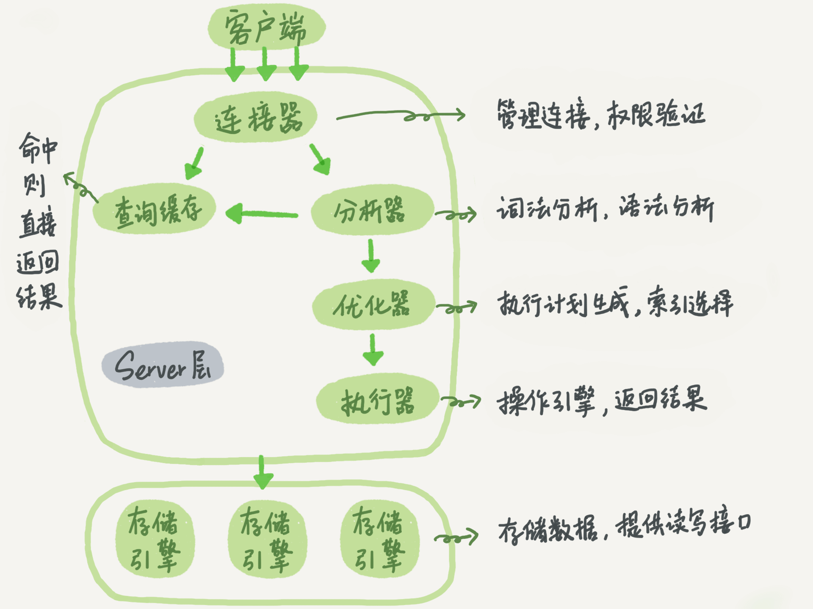
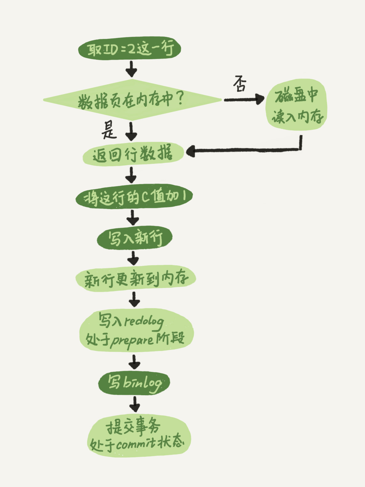
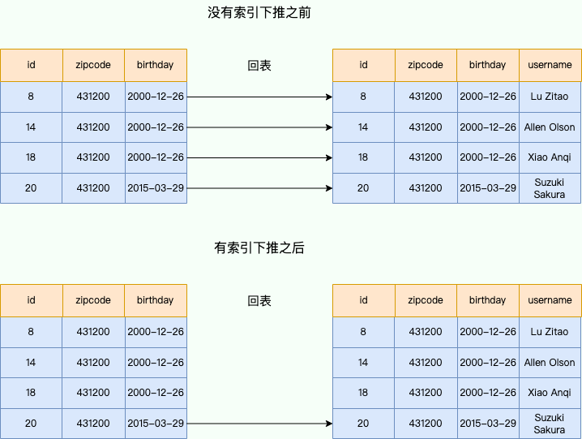

# Mysql-基础篇

## MySQL 基础架构



> 其实图相对重要一些，一些相关题目可以记忆这个图进行回答

Mysql分为Server层和存储引擎层两部分。

* **连接器：** 身份认证和权限相关
* **查询缓存：** 执行查询语句的时候，会先查询缓存(命中概率低，8.0移除)
* **分析器：** 进行词法分析和语法分析，检查是否正确以及进行鉴权
* **优化器：** 决定选择使用最优方案，例如匹配索引，多表关联(join)的连接顺序
* **执行器：** 执行语句，然后从存储引擎返回数据。 （会对实际运行的表进行鉴权）
* **插件式存储引擎**：主要负责数据的存储和读取，支持 InnoDB、MyISAM、Memory 等多种存储引擎。

### 1. 查询语句在Mysql 的执行过程

```sql
select * from tb_student  A where A.age='18' and A.name=' 张三 ';
```

1. 连接数据库
2. 在 MySQL8.0 版本以前，会先查询缓存，以这条 SQL 语句为 key 在内存中查询是否有结果。（在工程实现中，在查询缓存返回结果之前，做权限校验）。
3. 通过分析器进行词法分析，提取 SQL 语句的关键元素，比如提取上面这个语句是查询 select，提取需要查询的表名为 tb_student，需要查询所有的列，查询条件是这个表的 id='1'。然后判断这个 SQL 语句是否有语法错误，比如关键词是否正确等等，如果检查没问题就执行下一步。（注：在词法分析阶段，会进行 precheck 验证权限，判断是否有权限。）
4. 优化器进行确定执行方案，上面的 SQL 语句，可以有两种执行方案：a.先查询学生表中姓名为“张三”的学生，然后判断是否年龄是 18。b.先找出学生中年龄 18 岁的学生，然后再查询姓名为“张三”的学生。那么优化器根据自己的优化算法进行选择执行效率最好的一个方案（优化器认为，有时候不一定最好）。那么确认了执行计划后就准备开始执行了。
5. 在执行器过程，会先进行权限校验，然后会调用数据库引擎接口，返回引擎的执行结果。

### 2. 更新语句在Mysql 的执行过程

```sql
update tb_student A set A.age='19' where A.name=' 张三 ';
```

更新语句会沿着查询的流程走，与查询语句不同的是执行更新时候，会记录日志。

1. 执行器会找到目标行数据。如果目标行所在的数据页在内存（Buffer Pool ）中，就会直接返回执行器，否则需要从磁盘读入内存，再返回。
2. 执行器拿到引擎给的行数据，修改对应字段值，得到新的一行数据，再调用引擎接口写入这行新数据。
3. 引擎将这行新数据更新到内存中，同时将这个更新操作记录到 redo log 里面，此时 redo log 处于 prepare 状态。然后告知执行器执行完成了，随时可以提交事务。
4. 执行器生成这个操作的 binlog，并把 binlog 写入磁盘。
5. 执行器调用引擎的提交事务接口，引擎把刚刚写入的 redo log 改成提交（commit）状态，更新完成。



### 3. 为什么是两阶段提交日志

核心目的：保证两份日志之间的逻辑一致（数据一致性）。

从反证法说明：

* **先写 redo log 直接提交，然后写 binlog**：假设写完 redo log 后，机器挂了，binlog 日志没有被写入，那么机器重启后，这台机器会通过 redo log 恢复数据，但是这个时候 binlog 并没有记录该数据，后续进行机器备份的时候，就会丢失这一条数据，同时主从同步也会丢失这一条数据。

* **先写 binlog，然后写 redo log**，假设写完了 binlog，机器异常重启了，由于没有 redo log，本机是无法恢复这一条记录的，但是 binlog 又有记录，那么和上面同样的道理，就会产生数据不一致的情况。

### 4. 介绍涉及更新语句的两个日志

redo log（重做日志）：

* 是innodb引擎实现，是物理日志，记录某个数据页的修改。⽐如对 XXX 表空间中的 YYY 数据⻚ ZZZ 偏移量的地⽅做了AAA 更新  
* 固定大小，默认为4 GB，可以循环写。
* write pos 是当前记录的位置，一边写一边后移，写到第 3 号文件末尾后就回到 0 号文件开头。checkpoint 是当前要擦除的位置，也是往后推移并且循环的，擦除记录前要把记录更新到数据文件。
* 有了 redo log，InnoDB 就可以保证即使数据库发生异常重启，之前提交的记录都不会丢失，这个能力称为 `crash-safe`。⽤于掉电等故障恢复。  

binlog （归档日志）：

* 是server层实现，是逻辑日志，记录的是语句的原始逻辑。比如“给 ID=2 这一行的 c 字段加 1 ”
* 是可以追加写入的。“追加写”是指 binlog 文件写到一定大小后会切换到下一个，并不会覆盖以前的日志。
* 主要用于备份恢复，主从恢复。

### 其他问题

* 两个日志的区别
* 两阶段执行过程


## 数据库事务

### 1. 介绍事务的特性

数据库事务可以保证多个对数据库的操作（也就是 SQL 语句）构成一个逻辑上的整体。简单说：**要么全部执行成功,要么全部不执行** 。

具有ACID特性：

* **原子性**（`Atomicity`）：事务是最小的执行单位，不允许分割。事务的原子性确保动作要么全部完成，要么完全不起作用；

* **一致性**（`Consistency`）：执行事务前后，数据保持一致，例如转账业务中，无论事务是否成功，转账者和收款人的总额应该是不变的；

* **隔离性**（`Isolation`）：并发访问数据库时，一个用户的事务不被其他事务所干扰，各并发事务之间数据库是独立的；

* **持久性**（`Durability`）：一个事务被提交之后。它对数据库中数据的改变是持久的，即使数据库发生故障也不应该对其有任何影响。

注意：**只有保证了事务的持久性、原子性、隔离性之后，一致性才能得到保障。也就是说 A、I、D 是手段，C 是目的！**

### 2. 并发事务带来的问题

* 脏读（Dirty read）：读取到其他事务未提交的数据。
* 丢失修改（Lost to modify）：指两个或多个事务同时对同一数据进行更新操作，其中一个事务的更新被另一个事务覆盖，导致前一个事务的修改丢失。
* 不可重复读（Unrepeatable read）：在一个事务中，前后读取的记录内容不一致；
* 幻读（Phantom read）：在一个事务中，前后读取的记录数量不一致。

### 3. 不同事务隔离级别的区别

* **READ-UNCOMMITTED(读取未提交)** ：可以读取尚未提交的数据变更。

* **READ-COMMITTED(读取已提交)** ：可以读取其他并发事务已经提交的数据。

* **REPEATABLE-READ(可重复读)** ：对同一字段的多次读取结果都是一致的。

* **SERIALIZABLE(可串行化)** ：加读写锁，保证所有的事务依次逐个执行。

在不同隔离级别下可能发生的问题：

| 隔离级别 | 脏读 | 不可重复读 | 幻读 |
| :------: | :--: | :--------: | :--: |
| 读未提交 |  √   |     √      |  √   |
|  读提交  |  ×   |     √      |  √   |
| 可重复读 |  ×   |     ×      |  √   |
|  串行化  |  ×   |     ×      |  ×   |

### 4. 事务隔离的实现

在实现上，数据库里面会创建一个视图，访问的时候以视图的逻辑结果为准。

* 在“可重复读”隔离级别下，这个视图是在事务启动时创建的，整个事务存在期间都用这个视图。
* 在“读提交”隔离级别下，这个视图是在每个 SQL 语句开始执行的时候创建的。
* 这里需要注意的是，“读未提交”隔离级别下直接返回记录上的最新值，没有视图概念；
* 而“串行化”隔离级别下直接用加锁的方式来避免并行访问。

主要通过undo log版本链和read-view实现事务隔离。

### 5. 长事务的弊病

长事务意味着系统里面会存在很老的事务视图，在这个事务提交之前，回滚记录都要保留，这会导致大量占用存储空间。除此之外，长事务还占用锁资源，可能会拖垮库。


## 索引

### 1. 哈希表、有序数组和搜索树的优缺点

* 哈希表是一种以键值对存储数据的结构。适用于等值查询的场景，例如NoSQL引擎，区间查询的速度很慢。
* 有序数组在等值查询和范围查询的场景中性能优秀，但是在更新数据上，成本太高，只适用于静态存储引擎。
* 搜索树的特点是父节点左子树所有结点的值小于父节点的值，右子树所有结点的值大于父节点的值。二叉树树高过高，访问多个数据块，磁盘随机读取数据块过于耗时，会采用N叉树。N取决于数据块的大小。以InnoDB 的一个整数字段索引为例，在一个节点（页）中，这个 N 差不多是 1200。

### 2.主键索引和普通索引是什么，在查询中的区别是什么

在 InnoDB 中，表都是根据主键顺序以索引的形式存放的，每一个索引在 InnoDB 里面对应一棵 B+ 树。

主键索引的叶子节点存的是整行数据。在 InnoDB 里，主键索引也被称为**聚簇索引**（clustered index）。

非主键索引的叶子节点内容是主键的值。在 InnoDB 里，非主键索引也被称为**二级索引**（secondary index）。

在查询过程中，基于非主键索引的查询需要回表（到主键索引树在搜索一次），相比之下多扫描一颗索引树。


### 3. 主键不是有序的会带来什么问题，自增主键有什么优势，有没有什么场景适合用业务字段直接做主键的呢？

B+ 树为了维护索引有序性，在插入新值的时候需要做必要的维护。当页满了，根据 B+ 树的算法，需要申请一个新的数据页，然后挪动部分数据过去，这个过程称为页分裂。页分裂操作会影响性能也会影响数据页的利用率。

* 性能角度：自增主键的插入数据模式，正符合了递增插入的场景。每次插入一条新记录，都是追加操作，都不涉及到挪动其他记录，也不会触发叶子节点的分裂。而有业务逻辑的字段做主键，则往往不容易保证有序插入，这样写数据成本相对较高。
* 存储空间：主键长度越小，普通索引的叶子节点就越小，普通索引占用的空间也就越小。

在场景是==只有一个索引；该索引必须是唯一索引==（KV场景），适合用业务字段直接做主键。

### 4. 一条Sql查询语句，会扫描多少行以及几次树的搜索操作

```sql
# 表：主键ID索引，k索引
+-----+---+----+
| ID  | k | s  |
+-----+---+----+
| 100 | 1 | aa |
| 200 | 2 | bb |
| 300 | 3 | cc |
| 500 | 5 | ee |
| 600 | 6 | ff |
| 700 | 7 | gg |
+-----+---+----+
# 执行语句：
select * from T where k between 3 and 5
```


这条 SQL 查询语句的执行流程：

* 在 k 索引树上找到 k=3 的记录，取得 ID = 300；
* 再到 ID 索引树查到 ID=300 对应的 R3；
* 在 k 索引树取下一个值 k=5，取得 ID=500；
* 再回到 ID 索引树查到 ID=500 对应的 R4；
* 在 k 索引树取下一个值 k=6，不满足条件，循环结束。

### 5. 说一下覆盖索引和联合索引

如果一个索引包含（或者说覆盖）所有需要查询的字段的值，（核心是无需回表查询），就称之为 **覆盖索引（Covering Index）** 。

由于覆盖索引可以减少树的搜索次数，显著提升查询性能。

使用表中的多个字段创建索引，就是 **联合索引**。

### 6. 最左前缀原则详细介绍

最左前缀匹配原则指的是在使用索引时候，查询条件满足左前缀条件，可以利用索引加速检索。最左前缀可以是联合索引的最左 N 个字段，也可以是字符串索引的最左 M 个字符。

对于一个联合索引 `(A, B, C)`：

- 索引能被以下查询利用：
  - `WHERE A = ?`
  - `WHERE A = ? AND B = ?`
  - `WHERE A = ? AND B = ? AND C = ?`

最左匹配原则会一直向右匹配，直到遇到范围查询（如 >、<）为止。对于 >=、<=、BETWEEN 以及前缀匹配 LIKE 的范围查询，不会停止匹配。

### 7. 如何安排索引内的字段顺序

* 如果通过调整顺序，可以帮助少维护一个索引。
* 可以将区分度高的字段放在最左边，这也可以过滤更多数据。

* 考虑空间。

### 8. 索引下推详细介绍

索引下推优化（index condition pushdown)是指在索引遍历过程中，对索引中包含的字段先做判断，直接过滤掉不满足条件的记录，减少回表次数，提高查询效率。

```sql
SELECT * FROM user WHERE zipcode = '431200' AND MONTH(birthdate) = 3;
```



## 锁

### 1. 全局锁是什么，在哪些场景下使用。


### 2. 表级别的锁有哪些？


### 3. 如何安全的给小表添加字段？


### 4. 行锁是什么，两阶段协议是什么？


### 5.死锁是什么，如何解决？


### 6.怎么解决由这种热点行更新导致的性能问题呢？