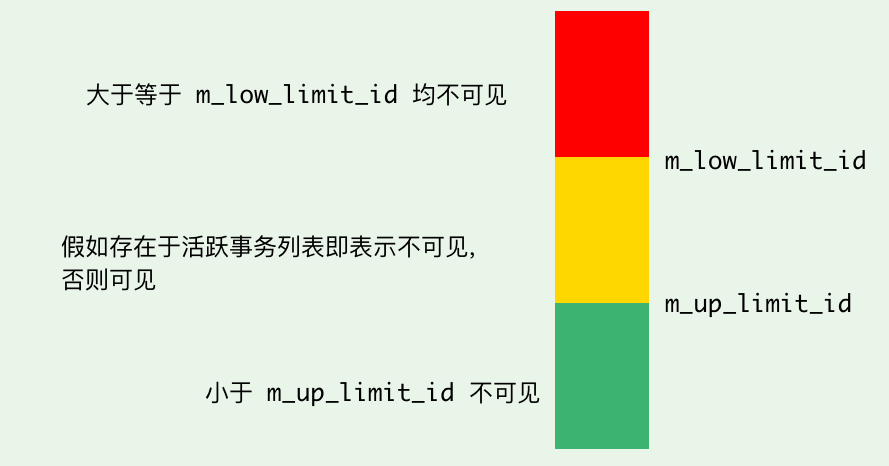

## MySQL 基础架构


> 其实图相对重要一些，一些相关题目可以记忆这个图进行回答

Mysql分为Server层和存储引擎层两部分。

* **连接器：** 身份认证和权限相关
* **查询缓存：** 执行查询语句的时候，会先查询缓存(命中概率低，8.0移除)
* **分析器：** 进行词法分析和语法分析，检查是否正确以及进行鉴权
* **优化器：** 决定选择使用最优方案，例如匹配索引，多表关联(join)的连接顺序
* **执行器：** 执行语句，然后从存储引擎返回数据。 （会对实际运行的表进行鉴权）
* **插件式存储引擎**：主要负责数据的存储和读取，支持 InnoDB、MyISAM、Memory 等多种存储引擎。 

### 1. 查询语句在Mysql 的执行过程

```sql
select * from tb_student  A where A.age='18' and A.name=' 张三 ';
```

1. 连接数据库
2. 在 MySQL8.0 版本以前，会先查询缓存，以这条 SQL 语句为 key 在内存中查询是否有结果。（在工程实现中，在查询缓存返回结果之前，做权限校验）。
3. 通过分析器进行词法分析，提取 SQL 语句的关键元素，比如提取上面这个语句是查询 select，提取需要查询的表名为 tb_student，需要查询所有的列，查询条件是这个表的 id='1'。然后判断这个 SQL 语句是否有语法错误，比如关键词是否正确等等，如果检查没问题就执行下一步。（注：在词法分析阶段，会进行 precheck 验证权限，判断是否有权限。）
4. 优化器进行确定执行方案，上面的 SQL 语句，可以有两种执行方案：a.先查询学生表中姓名为“张三”的学生，然后判断是否年龄是 18。b.先找出学生中年龄 18 岁的学生，然后再查询姓名为“张三”的学生。那么优化器根据自己的优化算法进行选择执行效率最好的一个方案（优化器认为，有时候不一定最好）。那么确认了执行计划后就准备开始执行了。
5. 在执行器过程，会先进行权限校验，然后会调用数据库引擎接口，返回引擎的执行结果。

### 2. 更新语句在Mysql 的执行过程

```sql
update tb_student A set A.age='19' where A.name=' 张三 ';
```

更新语句会沿着查询的流程走，与查询语句不同的是执行更新时候，会记录日志。

1. 执行器会找到目标行数据。如果目标行所在的数据页在内存（Buffer Pool ）中，就会直接返回执行器，否则需要从磁盘读入内存，再返回。
2. 执行器拿到引擎给的行数据，修改对应字段值，得到新的一行数据，再调用引擎接口写入这行新数据。
3. 引擎将这行新数据更新到内存中，同时将这个更新操作记录到 redo log 里面，此时 redo log 处于 prepare 状态。然后告知执行器执行完成了，随时可以提交事务。
4. 执行器生成这个操作的 binlog，并把 binlog 写入磁盘。
5. 执行器调用引擎的提交事务接口，引擎把刚刚写入的 redo log 改成提交（commit）状态，更新完成。


### 3. 为什么是两阶段提交日志

核心目的：保证两份日志之间的逻辑一致（数据一致性）。

从反证法说明：

* **先写 redo log 直接提交，然后写 binlog**：假设写完 redo log 后，机器挂了，binlog 日志没有被写入，那么机器重启后，这台机器会通过 redo log 恢复数据，但是这个时候 binlog 并没有记录该数据，后续进行机器备份的时候，就会丢失这一条数据，同时主从同步也会丢失这一条数据。

* **先写 binlog，然后写 redo log**，假设写完了 binlog，机器异常重启了，由于没有 redo log，本机是无法恢复这一条记录的，但是 binlog 又有记录，那么和上面同样的道理，就会产生数据不一致的情况。

### 4. 介绍涉及更新语句的两个日志

redo log（重做日志）：

* 是innodb引擎实现，是物理日志，记录某个数据页的修改。⽐如对 XXX 表空间中的 YYY 数据⻚ ZZZ 偏移量的地⽅做了AAA 更新  
* 固定大小，默认为4 GB，可以循环写。
* write pos 是当前记录的位置，一边写一边后移，写到第 3 号文件末尾后就回到 0 号文件开头。checkpoint 是当前要擦除的位置，也是往后推移并且循环的，擦除记录前要把记录更新到数据文件。
* 有了 redo log，InnoDB 就可以保证即使数据库发生异常重启，之前提交的记录都不会丢失，这个能力称为 `crash-safe`。⽤于掉电等故障恢复。  

binlog （归档日志）：

* 是server层实现，是逻辑日志，记录的是语句的原始逻辑。比如“给 ID=2 这一行的 c 字段加 1 ”
* 是可以追加写入的。“追加写”是指 binlog 文件写到一定大小后会切换到下一个，并不会覆盖以前的日志。
* 主要用于备份恢复，主从恢复。

### 5. 什么是数据页的空洞，如何解决？

在InnoDB引擎中，删除某一行数据，会把这个一行数据标记为删除，表明可以复用。行数据的复用，只限于符合范围条件的数据。当你随机删除过多，会造成一个数据页中存在很多可以复用但是没有被使用的地方，称之为空洞。

不止是删除数据会造成空洞，插入数据也会。

当把一个数据页上的所有数据都删除，表明数据页也可以被复用，但是表空间不会回收。

解决方案：使用Online DDL方式重建表

重建表的流程：

* 建立一个临时文件，扫描表 A 主键的所有数据页；
* 用数据页中表 A 的记录生成 B+ 树，存储到临时文件中；
* 生成临时文件的过程中，将所有对 A 的操作记录在一个日志文件（row log）中；
* 临时文件生成后，将日志文件中的操作应用到临时文件，得到一个逻辑数据上与表 A 相同的数据文件；
* 用临时文件替换表 A 的数据文件。

### 6. 在 select count(?) from t 这样的查询语句里面，count(*)、count(主键 id)、count(字段) 和 count(1) 等不同用法的性能，有哪些差别。

* count(主键 id) ：InnoDB 引擎会遍历整张表，把每一行的 id 值都取出来，返回给 server 层。server 层拿到 id 后，判断是不可能为空的，就按行累加。
* count(1)：InnoDB 引擎遍历整张表，但不取值。server 层对于返回的每一行，往count函数放一个数字“1”进去，判断是不可能为空的，按行累加。
* count(字段) ：【如果没有索引，走主键索引】
  * 如果这个“字段”是定义为 not null 的话，一行行地从记录里面读出这个字段，判断不能为 null，按行累加；
  * 如果这个“字段”定义允许为 null，那么执行的时候，判断到有可能是 null，还要把值取出来再判断一下，不是 null 才累加。
* count(*)：不需要取值，按行累加。【可能走最小的索引】

按照效率排序的话，count(字段)<count(主键id)<count(1) ≈ count(*)

### 7.order by 中是如何排序的吗？

有这样一个sql语句：

```sql
select city,name,age from t where city='杭州' order by name limit 1000  ; # city是索引
```

这个语句执行流程如下所示 ：

* 初始化 sort_buffer，确定放入 name、city、age 这三个字段；
* 从索引 city 找到第一个满足 city='杭州’条件的主键 id，也就是图中的 ID_X；
* 到主键 id 索引取出整行，取 name、city、age 三个字段的值，存入 sort_buffer 中；
* 从索引 city 取下一个记录的主键 id；
* 重复步骤 3、4 直到 city 的值不满足查询条件为止，对应的主键 id 也就是图中的 ID_Y；
* 对 sort_buffer 中的数据按照字段 name 做快速排序；按照排序结果取前 1000 行返回给客户端。、

MySQL 会给每个线程分配一块内存用于排序，称为 sort_buffer。

也称之为全字段排序（把所需字段全放入 sort_buffer中）。

==对于 InnoDB 表来说，执行全字段排序会减少磁盘访问，因此会被优先选择。==

### 8. 全字段排序有什么性能限制吗？

排序，可能在内存中完成，也可能需要使用外部排序，这取决于排序所需的内存和参数 sort_buffer_size。

排序的数据量小于 sort_buffer_size，排序就在内存中完成。但如果排序数据量太大，内存放不下，则需要利用磁盘临时文件辅助排序。

外部排序一般使用多路归并排序算法。

如果查询要返回的字段很多的话，那么 sort_buffer 里面要放的字段数太多，这样内存里能够同时放下的行数很少，要分成很多个临时文件，排序的性能会很差。

### 9. 如何优化全字段排序带来的性能限制？

* 增大 `sort_buffer_size`：尽量提高内存中的排序缓冲区大小，使得内存能够容纳更多的行，减少生成临时文件的数量。

* 减少查询中返回的字段数量：查询时只返回必要的字段（使用 `SELECT` 时避免 `SELECT *`），减少单行数据占用的空间，从而让内存能够存储更多行。
* 构建联合\覆盖索引：让结果是有序的，减少排序过程。
* 让Mysql 采用另一种排序方法：rowId 排序。

### 10. rowid 排序是如何执行的？

max_length_for_sort_data，是 MySQL 中专门控制用于排序的行数据的长度的一个参数。如果单行的长度超过这个值，MySQL 就认为单行太大，要换一个算法。

整个执行流程：

* 初始化 sort_buffer，确定放入两个字段，即 name 和 id；
* 从索引 city 找到第一个满足 city='杭州’条件的主键 id，也就是图中的 ID_X；
* 到主键 id 索引取出整行，取 name、id 这两个字段，存入 sort_buffer 中；
* 从索引 city 取下一个记录的主键 id；
* 重复步骤 3、4 直到不满足 city='杭州’条件为止，也就是图中的 ID_Y；
* 对 sort_buffer 中的数据按照字段 name 进行排序；遍历排序结果，取前 1000 行，并按照 id 的值回到原表中取出 city、name 和 age 三个字段返回给客户端。

与全字段排序的区别：

* sort_buffer 只放入和排序相关的字段
* 多了一次回表的过程，一般优化器会选择全字段排序。

==如果 MySQL 认为排序内存太小，会采用 rowid 排序算法，如果 MySQL 认为内存足够大，会优先选择全字段排序。==

### 11.目前你返回的数据行数较多，如果返回行数较少，那么会使用什么排序？

在 MySQL 中，排序会优先尝试使用内存：

* 当需要排序的数据量小于 `sort_buffer_size` 时，MySQL 会将数据加载到内存中并直接进行排序（通常使用快速排序）；
* 如果数据量大于 `sort_buffer_size`，MySQL 会将数据分批加载到内存中，执行部分排序后写入临时文件，最后通过外部归并排序完成整体排序。
* 如果单行大于`max_length_for_sort_data`,Mysql将会使用rowid的排序。
* 对于 `ORDER BY ... LIMIT N` 的场景，MySQL 可能使用堆排序（优先队列）来优化性能，动态维护前 N 条记录，从而避免完全排序。
* 临时文件的使用则是基于内存不足时存储中间结果的需要。

### 12. order by rand() 是如何执行的？

1. **读取数据集**：MySQL 从存储引擎中读取目标表中的所有符合条件的行（如果没有 `WHERE` 条件，则读取整个表）。
2. **生成随机值**：对于每一行，调用 `RAND()` 函数生成一个随机值，并将随机值与该行的数据关联存储在内存或临时表中。
3. **排序**：使用内存中的随机值作为排序键，对数据进行排序。如果数据量过大而无法全部放入内存，则使用磁盘上的临时文件进行外部排序。
4. **返回结果**：根据排序后的数据返回结果。如果指定了 `LIMIT`，则只返回前 N 条数据；否则返回排序后的所有行。

注意事项：

- `ORDER BY RAND()` 对所有行生成随机数并排序，导致 CPU 和内存消耗较大。当表很大时，会严重影响性能。

优化建议：

  - 预先选取随机主键范围（如 `WHERE id >= FLOOR(RAND() * max_id)`）结合 `LIMIT`。
  - 使用应用层随机化，而非在 SQL 层执行。

### 其他问题

* 两个日志的区别
* 两阶段执行过程


## 数据库事务

### 1. 介绍事务的特性

数据库事务可以保证多个对数据库的操作（也就是 SQL 语句）构成一个逻辑上的整体。简单说：**要么全部执行成功,要么全部不执行** 。

具有ACID特性：

* **原子性**（`Atomicity`）：事务是最小的执行单位，不允许分割。事务的原子性确保动作要么全部完成，要么完全不起作用；

* **一致性**（`Consistency`）：执行事务前后，数据保持一致，例如转账业务中，无论事务是否成功，转账者和收款人的总额应该是不变的；

* **隔离性**（`Isolation`）：并发访问数据库时，一个用户的事务不被其他事务所干扰，各并发事务之间数据库是独立的；

* **持久性**（`Durability`）：一个事务被提交之后。它对数据库中数据的改变是持久的，即使数据库发生故障也不应该对其有任何影响。

注意：**只有保证了事务的持久性、原子性、隔离性之后，一致性才能得到保障。也就是说 A、I、D 是手段，C 是目的！**

### 2. 并发事务带来的问题

* 脏读（Dirty read）：读取到其他事务未提交的数据。
* 丢失修改（Lost to modify）：指两个或多个事务同时对同一数据进行更新操作，其中一个事务的更新被另一个事务覆盖，导致前一个事务的修改丢失。
* 不可重复读（Unrepeatable read）：在一个事务中，前后读取的记录内容不一致；
* 幻读（Phantom read）：在一个事务中，前后读取的记录数量不一致。

### 3. 不同事务隔离级别的区别

* **READ-UNCOMMITTED(读取未提交)** ：可以读取尚未提交的数据变更。

* **READ-COMMITTED(读取已提交)** ：可以读取其他并发事务已经提交的数据。

* **REPEATABLE-READ(可重复读)** ：对同一字段的多次读取结果都是一致的。

* **SERIALIZABLE(可串行化)** ：加读写锁，保证所有的事务依次逐个执行。

在不同隔离级别下可能发生的问题：

| 隔离级别 | 脏读 | 不可重复读 | 幻读 |
| :------: | :--: | :--------: | :--: |
| 读未提交 |  √   |     √      |  √   |
|  读提交  |  ×   |     √      |  √   |
| 可重复读 |  ×   |     ×      |  √   |
|  串行化  |  ×   |     ×      |  ×   |

### 4. 事务隔离的可见性实现

在实现上，数据库里面会创建一个视图，访问的时候以视图的逻辑结果为准。

* 在“可重复读”隔离级别下，这个视图是在事务启动时创建的，整个事务存在期间都用这个视图。
* 在“读提交”隔离级别下，这个视图是在每个 SQL 语句开始执行的时候创建的。
* “读未提交”隔离级别下直接返回记录上的最新值，没有视图概念；
* 而“串行化”隔离级别下直接用加锁的方式来避免并行访问。

### 5. 长事务的弊病

长事务意味着系统里面会存在很老的事务视图，在这个事务提交之前，回滚记录都要保留，这会导致大量占用存储空间。除此之外，长事务还占用锁资源，可能会拖垮库。

### 6. MVCC是什么

MVCC 是一种并发控制机制，用于在多个并发事务同时读写数据库时保持数据的一致性和隔离性。

读操作：当一个事务执行读操作时，它会使用快照读取。快照读取是基于事务开始时数据库中的状态创建的，因此事务不会读取其他事务尚未提交的修改。

写操作：当一个事务执行写操作时，它会生成一个新的数据版本，事务提交后将修改后的数据写入数据库。

为了防止数据库中的版本无限增长，MVCC 会定期进行版本的回收。回收机制会删除已经不再需要的旧版本数据，从而释放空间。

### 7.MVVC中的快照是如何实现的

InnoDB 里面每个事务有一个唯一的事务 ID，叫作 transaction id。它是在事务开始的时候向 InnoDB 的事务系统申请的，是按申请顺序严格递增的。

数据表中的一行记录，有多个版本 (row)，每个版本有自己的 row trx_id，是transaction id进行赋值的。


当一个事务修改表中数据的某一行时，将旧版本的数据插入 Undo Log 中，看到的视图不是物理上物理上真实存在的，而是每次需要的时候根据当前版本和 undo log 计算出来的。比如，需要 V2 视图的时候，就是通过 V4 依次执行 U3、U2 算出来。根据 row trx_id、undo log这些信息，实现了数据行的多版本效果。

在 `InnoDB` 存储引擎中，创建一个新事务后，执行每个 `select` 语句前，都会创建一个快照（Read View），**快照中保存了当前数据库系统中正处于活跃（没有 commit）的事务的 ID 号**（即 m_ids）。

Read View 存在两个变量：

* m_up_limit_id：数组里面事务 ID 的最小值
* m_low_limit_id ：当前系统里面已经创建过的事务 ID 的最大值

当用户在这个事务中要读取某个记录行的时候，`InnoDB` 会将该记录行的 `row TRX_ID` 与 `Read View` 中的这两个变量 进行比较，判断是否满足可见性条件，不满足就回滚。



一个数据版本的 row trx_id，有以下几种可能：

* 如果落在绿色部分，表示这个版本是已提交的事务或者是当前事务自己生成的，这个数据是可见的；
* 如果落在红色部分，表示这个版本是由将来启动的事务生成的，是肯定不可见的；
* 如果落在黄色部分，那就包括两种情况
  * a. 若 row trx_id 在数组中，表示这个版本是由还没提交的事务生成的，不可见；
  * b. 若 row trx_id 不在数组中，表示这个版本是已经提交了的事务生成的，可见。

核心简写：

* 版本未提交，不可见；
* 版本已提交，但是是在视图创建后提交的，不可见；
* 版本已提交，而且是在视图创建前提交的，可见。

总结：

* row trx_id 和  transaction id 给每个数据行提供版本号
* undo log 提供版本链，帮助回滚到需要的数据
* 该记录行的 `row TRX_ID` 与 `Read View` 中的这两个变量 m_up_limit_id 和 m_low_limit_id 进行比较，判断是否满足可见性条件，不满足就回滚。


### 8. 一致性读和当前读是什么

一致性读是指事务在开启视图时候，直至提交之前，读行数据始终保持一致。主要用到**MVCC（多版本并发控制）** 技术，在事务中，查询语句不会看到其他事务未提交以及以后事务的更改。

当前读是指读取行数据的最新版本，通过给行数据加行锁来保证的。如果当前的行数据的行锁被其他事务占用的话，就需要进入锁等待。在事务中 update 语句以及select 语句加锁，都是当前读。


### 其他问题


### 参考文献：

* https://leviathan.vip/2019/03/20/InnoDB%E7%9A%84%E4%BA%8B%E5%8A%A1%E5%88%86%E6%9E%90-MVCC/#MVCC-1
* 


## 索引

### 1. 哈希表、有序数组和搜索树的优缺点

* 哈希表是一种以键值对存储数据的结构。适用于等值查询的场景，例如NoSQL引擎，区间查询的速度很慢。
* 有序数组在等值查询和范围查询的场景中性能优秀，但是在更新数据上，成本太高，只适用于静态存储引擎。
* 搜索树的特点是父节点左子树所有结点的值小于父节点的值，右子树所有结点的值大于父节点的值。二叉树树高过高，访问多个数据块，磁盘随机读取数据块过于耗时，会采用N叉树。N取决于数据块的大小。以InnoDB 的一个整数字段索引为例，在一个节点（页）中，这个 N 差不多是 1200。

### 2.主键索引和普通索引是什么，在查询中的区别是什么

在 InnoDB 中，表都是根据主键顺序以索引的形式存放的，每一个索引在 InnoDB 里面对应一棵 B+ 树。

主键索引的叶子节点存的是整行数据。在 InnoDB 里，主键索引也被称为**聚簇索引**（clustered index）。

非主键索引的叶子节点内容是主键的值。在 InnoDB 里，非主键索引也被称为**二级索引**（secondary index）。

在查询过程中，基于非主键索引的查询需要回表（到主键索引树在搜索一次），相比之下多扫描一颗索引树。


### 3. 主键不是有序的会带来什么问题，自增主键有什么优势，有没有什么场景适合用业务字段直接做主键的呢？

B+ 树为了维护索引有序性，在插入新值的时候需要做必要的维护。当页满了，根据 B+ 树的算法，需要申请一个新的数据页，然后挪动部分数据过去，这个过程称为页分裂。页分裂操作会影响性能也会影响数据页的利用率。

* 性能角度：自增主键的插入数据模式，正符合了递增插入的场景。每次插入一条新记录，都是追加操作，都不涉及到挪动其他记录，也不会触发叶子节点的分裂。而有业务逻辑的字段做主键，则往往不容易保证有序插入，这样写数据成本相对较高。
* 存储空间：主键长度越小，普通索引的叶子节点就越小，普通索引占用的空间也就越小。

在场景是==只有一个索引；该索引必须是唯一索引==（KV场景），适合用业务字段直接做主键。

### 4. 一条Sql查询语句，会扫描多少行以及几次树的搜索操作

```sql
# 表：主键ID索引，k索引
+-----+---+----+
| ID  | k | s  |
+-----+---+----+
| 100 | 1 | aa |
| 200 | 2 | bb |
| 300 | 3 | cc |
| 500 | 5 | ee |
| 600 | 6 | ff |
| 700 | 7 | gg |
+-----+---+----+
# 执行语句：
select * from T where k between 3 and 5
```


这条 SQL 查询语句的执行流程：

* 在 k 索引树上找到 k=3 的记录，取得 ID = 300；
* 再到 ID 索引树查到 ID=300 对应的 R3；
* 在 k 索引树取下一个值 k=5，取得 ID=500；
* 再回到 ID 索引树查到 ID=500 对应的 R4；
* 在 k 索引树取下一个值 k=6，不满足条件，循环结束。

### 5. 说一下覆盖索引和联合索引

如果一个索引包含（或者说覆盖）所有需要查询的字段的值，（核心是无需回表查询），就称之为 **覆盖索引（Covering Index）** 。

由于覆盖索引可以减少树的搜索次数，显著提升查询性能。

使用表中的多个字段创建索引，就是 **联合索引**。

### 6. 最左前缀原则详细介绍

最左前缀匹配原则指的是在使用索引时候，查询条件满足左前缀条件，可以利用索引加速检索。最左前缀可以是联合索引的最左 N 个字段，也可以是字符串索引的最左 M 个字符。

对于一个联合索引 `(A, B, C)`：

- 索引能被以下查询利用：
  - `WHERE A = ?`
  - `WHERE A = ? AND B = ?`
  - `WHERE A = ? AND B = ? AND C = ?`

最左匹配原则会一直向右匹配，直到遇到范围查询（如 >、<）为止。对于 >=、<=、BETWEEN 以及前缀匹配 LIKE 的范围查询，不会停止匹配。

### 7. 如何安排索引内的字段顺序

* 如果通过调整顺序，可以帮助少维护一个索引。
* 可以将区分度高的字段放在最左边，这也可以过滤更多数据。

* 考虑空间。

### 8. 索引下推详细介绍

索引下推优化（index condition pushdown)是指在索引遍历过程中，对索引中包含的字段先做判断，直接过滤掉不满足条件的记录，减少回表次数，提高查询效率。

```sql
SELECT * FROM user WHERE zipcode = '431200' AND MONTH(birthdate) = 3;
```


### 9. 普通索引和唯一索引在查询和更新有什么区别

在查询过程中：

* 对于普通索引来说，查找到满足条件的第一个记录 (5,500) 后，需要查找下一个记录，直到碰到第一个不满足 k=5 条件的记录。
* 对于唯一索引来说，由于索引定义了唯一性，查找到第一个满足条件的记录后，就会停止继续检索。

查询带来的性能差距是微乎其微。

在更新过程中：

第一种情况是，这个记录要更新的目标页在内存中。

* 对于唯一索引来说，找到 3 和 5 之间的位置，判断到没有冲突，插入这个值，语句执行结束；
* 对于普通索引来说，找到 3 和 5 之间的位置，插入这个值，语句执行结束。

在该情况下，性能差别很小。

第二种情况是，这个记录要更新的目标页不在内存中。

* 对于唯一索引来说，需要将数据页读入内存，判断到没有冲突，插入这个值，语句执行结束；
* 对于普通索引来说，则是将更新记录在 change buffer，语句执行就结束了。

因为将数据从磁盘读入内存涉及随机 IO 的访问，是成本比较高的操作，对于唯一索引就需要不断地将数据页读入内存，然后change buffer 因为减少了随机磁盘访问，所以对更新性能的提升是会很明显的。

### 10. change Buffer 是什么？

当某个行数据所在的数据页还没有在内存中的话，在不影响数据一致性的前提下，InnoDB 会将这些更新操作缓存在 change buffer 中，这样就不需要从磁盘中读入这个数据页了，后续会将里面操作应用在原数据页中。

当访问这个数据页（将数据页读入内存中）会触发 merge 操作，在写多读少的业务场景中，在一个数据页做 merge 之前，change buffer 记录的变更越多（也就是这个页面上要更新的次数越多），使用效果越好。但是在写入之后马上会做查询场景中，会触发change buffer的merge 过程，增加了 change buffer 的维护代价。

### 11. change buffer 和 redo log 都是减少随机读写，那么之间区别是什么

* redo log 主要节省的是随机写磁盘的 IO 消耗（转成顺序写）（将内存的数据写入磁盘中）

* change buffer 主要节省的则是随机读磁盘的 IO 消耗。（主要是将更新动作变缓，减少读入数据页的过程，）

### 12. 当机器掉电重启，会不会导致 change buffer 丢失呢，会不会发生数据丢失情况？

不会丢失。

* Change Buffer 的内容不仅仅在内存中也会持久化，同时Change Buffer 的修改操作（如插入、更新或删除）也会被记录到 **Redo Log** 中。

* 在数据库掉电恢复时会重放 Redo Log，恢复未完成的事务和未刷入磁盘的修改，包括 Change Buffer 的修改。如果 Change Buffer 中有未完成的合并操作，InnoDB 会通过后台线程继续执行这些合并，将修改逐步应用到目标数据页。

### 13. 前缀索引优缺点

优点：

* 使用前缀索引和字段区分度有很大的关系，区分度越高越好。
* 前缀索引可以对字符串的前缀构建索引，定义好前缀长度，就可以做到既节省空间，又不用额外增加太多的查询成本。

缺点：

* 使用前缀索引就用不上覆盖索引对查询性能的优化
* 前缀索引选取字段长度的越长，占用的磁盘空间就越大，相同的数据页能放下的索引值就越少，搜索的效率也就会越低。

提高前缀索引搜索效率方式：

* 对字符串字段进行处理使其区分度增加，例如倒叙、截断等；
* 使用hash字段；


## 锁

### 1. 全局锁是什么，在哪些场景下使用。

全局锁就是对整个数据库实例加锁。全局锁的典型使用场景是，做全库逻辑备份。

使用风险：

* 如果在主库备份，在备份期间不能更新，业务停摆 
* 如果在从库备份，备份期间不能执行主库同步的binlog，导致主从延迟

对于InnoDB引擎，可以通过在可重复读隔离级别下开启一个事务，获取数据，在这个过程中数据是可以正常更新的。

官方自带的逻辑备份工具是 mysqldump。当 mysqldump 使用参数–single-transaction 的时候，导数据之前就会启动一个事务，来确保拿到一致性视图。（只适用于支持事务引擎）

### 2. 表级别的锁有哪些？

MySQL 里面表级别的锁有两种：一种是表锁，一种是元数据锁（meta data lock，MDL)。

表锁会限制别的线程的读写外，也可能限定了本线程的读写操作，一般用的少，影响面太大了。

MDL主要用于隔离DML（Data Manipulation Language，数据操纵语言，如select）和DDL（Data Definition Language，数据定义语言，如改表头新增一列）操作之间的干扰，保证对表数据读写正确。

当对一个表做增删改查操作的时候，加 MDL 读锁；当要对表做结构变更操作的时候，加 MDL 写锁。

### 3. 如何安全的给小表添加字段？

核心在于长事务存在DDL操作，后面有很多DML操作发生阻塞，导致线程爆满。

解决方案：超时、kill掉长事务

### 4. 行锁是什么，两阶段协议是什么？

行锁就是针对数据表中行数据的锁。

两阶段锁协议：在 InnoDB 事务中，行锁是在需要（更新/插入行数据）的时候才加上的，需要等到事务结束时才释放。

如果你的事务中需要锁多个行，要把最可能造成锁冲突、最可能影响并发度的锁尽量往后放，以减少锁等待的时间，提高并发性能。

### 5.死锁是什么，如何解决？

当并发系统中不同线程出现循环资源依赖，涉及的线程都在等待别的线程释放资源时，就会导致这几个线程都进入无限等待的状态，称为死锁。

当出现死锁以后，有两种策略：

* 一种策略是，直接进入等待，直到超时。
* 另一种策略是，发起死锁检测，发现死锁后，主动回滚死锁链条中的某一个事务，让其他事务得以继续执行。

对于业务来说，第一种策略是不可取的，时间太短，会出现很多误伤，时间太长影响体验。

正常情况下采用第二种策略，能够快速发现并进行处理的，但是它也是有额外负担的。当较多线程更新同一行，死锁检测会消耗大量的 CPU 资源。

### 6.怎么解决由这种热点行更新导致的性能问题呢？

高并发下避免死锁检测带来的负面影响： 

1. 确保业务上不会产生死锁，直接将死锁检测关闭。（innodb 自带死锁检测） 
2.  在数据库中间件中统一对更新同一行的请求进行排队，控制并发度。 
3. 业务逻辑上进行优化，将一行数据分解成多行，降低写入压力。


## 场景题

###  1. 在什么情况下会出现查一行数据会执行得特别慢的现象？

等锁

* 等表级锁，例如MDL写锁
* 等flush表
* 等行锁

查询慢

* 没有走索引，全表扫描
* 回滚日志过大引起的一致性读慢
