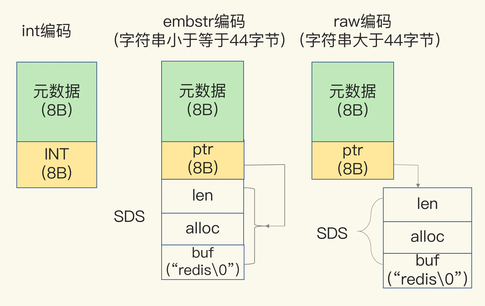
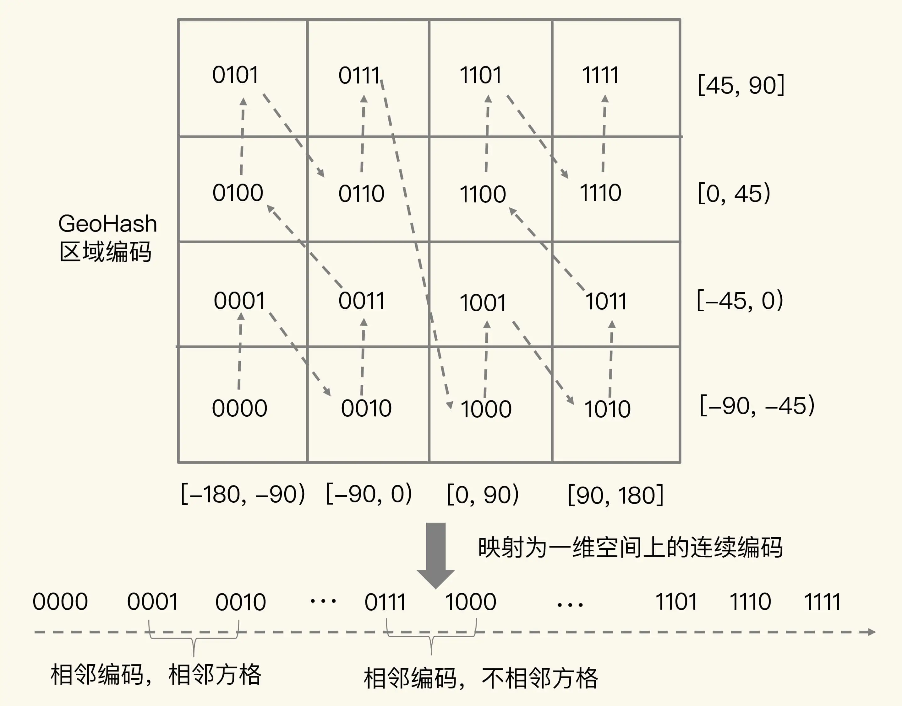
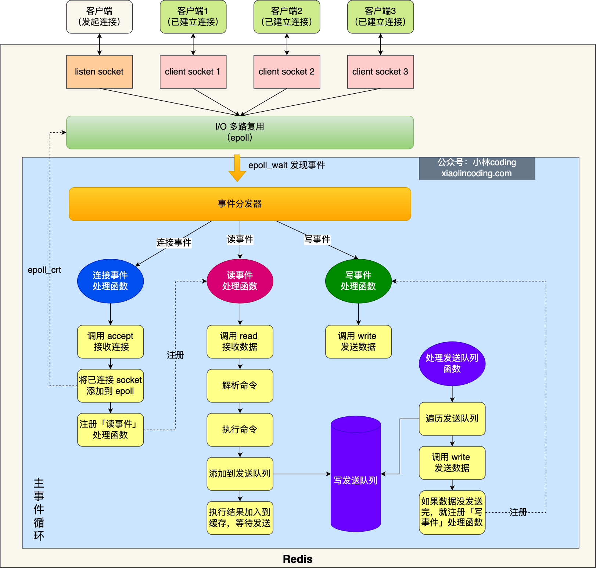
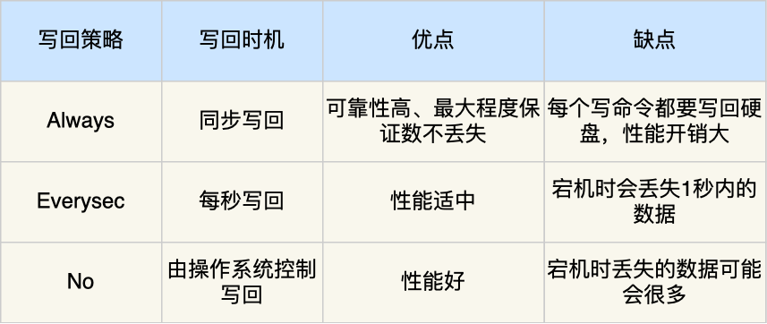
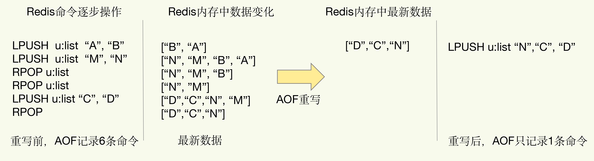
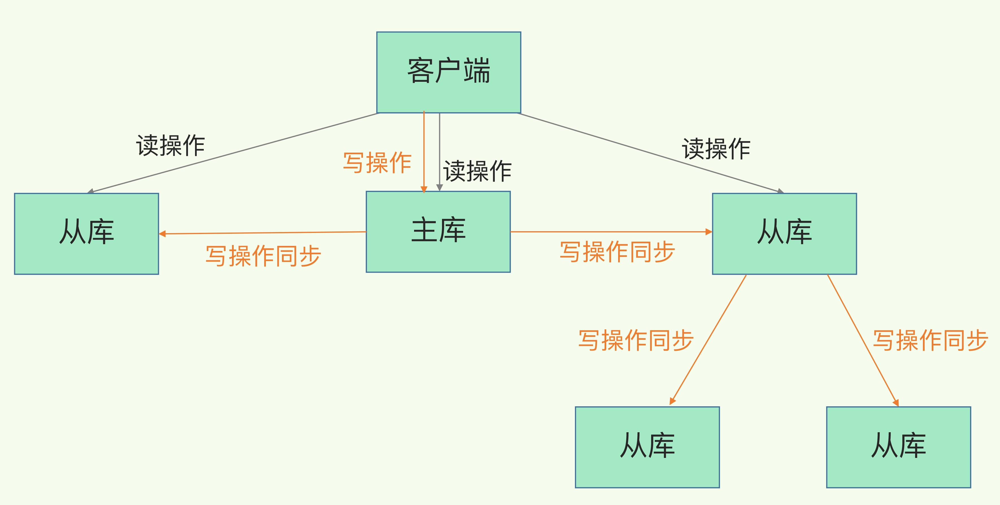

## 数据结构

### 1. Redis的数据类型以及实现的原理

Redis 中**5 种基础数据类型**：String（字符串）、List（列表）、Set（集合）、Hash（散列）、Zset（有序集合）。

又支持了四种数据类型： **BitMap（2.2 版新增）、HyperLogLog（2.8 版新增）、GEO（3.2 版新增）、Stream（5.0 版新增）**。


这些数据结构均为值的底层实现方式，在 Redis 中，核心在于键与值之间的组织。只要理解了这一核心要点，那么对于其他数据结构的操作，其实就是先找到值，然后在集合中进行相关操作。

Redis 使用了一个哈希表来保存所有键值对，一个哈希表，其实就是一个数组，数组的每个元素称为一个哈希桶。哈希表的每一项是一个 dictEntry 的结构体，dictEntry 结构中有三个 8 字节的指针，分别指向 key、value 以及下一个 dictEntry，三个指针共 24 字节。值保存的并不是值本身，而是指向具体值的指针。

Redis 会用一个 RedisObject 结构体来统一记录各个数据类型的元数据，同时指向实际数据。一个 RedisObject 包含了 8 字节的元数据和一个 8 字节指针。


### 2. 哈希表存在的冲突问题

当你往哈希表中写入更多数据时，可能两个 key 的哈希值和哈希桶计算对应关系时，正好落在了同一个哈希桶中。这就是哈希表存在的冲突问题。

Redis 解决哈希冲突的方式，就是链式哈希，就是指**同一个哈希桶中的多个元素用一个链表来保存，它们之间依次用指针连接**。

### 3. 为什么需要rehash？

哈希冲突链上的元素只能通过指针逐一查找再操作。如果哈希表里写入的数据越来越多，哈希冲突可能也会越来越多，这就会导致某些哈希冲突链过长，进而导致这个链上的元素查找耗时长，效率降低。

所以需要rehash操作，也就是增加现有的哈希桶数量，让逐渐增多的 entry 元素能在更多的桶之间分散保存，减少单个桶中的元素数量，从而减少单个桶中的冲突。

### 4. rehash是怎么做的，rehash会带来什么问题？怎么解决？

Redis 默认有两个全局哈希表：哈希表 1 和哈希表 2。开始插入数据时用哈希表 1，此时哈希表 2 未分配空间。数据增多时执行 rehash，分三步：

* 给哈希表 2 分配更大空间，如哈希表 1 的两倍；
* 把哈希表 1 数据重新映射并拷贝到哈希表 2；
* 释放哈希表 1 空间，然后切换到哈希表 2 保存更多数据，哈希表 1 留作下次 rehash 扩容备用。

（就是把数据向另一个更大的表拷贝了一下，之后就是两个表相互这样倒腾。）

存在一个问题：如果一次性把哈希表 1 中的数据都迁移完，会造成 Redis 线程阻塞，无法服务其他请求。此时，Redis 就无法快速访问数据了。

解决这个问题，采用**渐进式 rehash**。

在第二步拷贝数据时，Redis 正常处理客户端请求。每处理一个请求，就从哈希表 1 的第一个索引位置开始，顺带把此索引位置的所有 entries 拷贝到哈希表 2 。处理下一个请求时，再顺带拷贝哈希表 1 下一个索引位置的 entries。

**渐进式 rehash**巧妙地把一次性大量拷贝的开销，分摊到了多次处理请求的过程中，避免了耗时操作，保证了数据的快速访问。


> 如果有新的请求进来，在rehash过程中：
>
> 对于查询、删除、更新等操作，Redis 会先在当前正在使用的哈希表（一般称为旧表）中进行查找。如果没有找到，再到正在 rehash 的新哈希表中查找。
>
> 对于插入操作，如果当前正在 rehash，新元素可能会被插入到新哈希表中，以加快 rehash 的完成。

### 5. 整数数组和压缩列表在查找时间复杂度方面并没有很大的优势，那为什么 Redis 还会把它们作为底层数据结构呢？

* 整数数组和压缩列表在存储相对紧凑的数据时，能够更有效地利用内存空间。相比于一些更复杂的数据结构，它们减少了内存开销和内存碎片的产生。
* 在数据量较小且操作相对简单的场景下，整数数组和压缩列表的实现较为简单，操作的性能开销相对较低，可以更好地利用 CPU 的缓存机制，提高数据访问的效率。
* 即使当进行随机访问时，虽然不是顺序访问，但由于数组元素的内存地址相邻，第一次访问某个元素可能未命中高速缓存，但相邻元素被加载进高速缓存的概率较大。

### string

#### 内部实现

String 类型的底层的数据结构实现主要是 int 和 SDS（简单动态字符串）。

简单动态字符串（Simple Dynamic String，SDS）结构体，如下：

* buf：字节数组，保存实际数据。为了表示字节数组的结束，Redis 会自动在数组最后加一个“\0”，这就会额外占用 1 个字节的开销。

* len：占 4 个字节，表示 buf 的已用长度。

* alloc：也占个 4 字节，表示 buf 的实际分配长度，一般大于 len。

分配方式：

* 当保存的是 Long 类型整数时，RedisObject 中的指针就直接赋值为整数数据了，这样就不用额外的指针再指向整数了，节省了指针的空间开销。
* embstr 编码方式：当保存的是字符串数据，并且字符串小于等于 44 字节时，RedisObject 中的元数据、指针和 SDS 是一块连续的内存区域，这样就可以避免内存碎片。
* raw 编码：当字符串大于 44 字节时，SDS 的数据量就开始变多了，Redis 就不再把 SDS 和 RedisObject 布局在一起了，而是会给 SDS 分配独立的空间，并用指针指向 SDS 结构。



embstr 与 raw 编码优缺点：

* `embstr`编码将创建字符串对象所需的内存分配次数从 `raw` 编码的两次降低为一次；
* 释放 `embstr`编码的字符串对象同样只需要调用一次内存释放函数；
* 因为`embstr`编码的字符串对象的所有数据都保存在一块连续的内存里面可以更好的利用 CPU 缓存提升性能。
* **embstr编码的字符串对象实际上是只读的**，redis没有为embstr编码的字符串对象编写任何相应的修改程序。当我们对embstr编码的字符串对象执行任何修改命令（例如append）时，程序会先将对象的编码从embstr转换成raw，然后再执行修改命令。

#### 应用场景

* 缓存对象
* 分布式锁
* 共享 Session 信息

### List


### BitMap

Bitmap，即位图，是一串连续的二进制数组（0和1），可以通过偏移量（offset）定位元素。BitMap通过最小的单位bit来进行`0|1`的设置，表示某个元素的值或者状态，时间复杂度为O(1)。

#### 内部实现

Bitmap 本身是用 **动态字符串 (SDS, Simple Dynamic String)** 作为底层数据结构实现的一种统计二值状态的数据类型。

Redis 将其存储为普通的字符串对象，但允许对其进行位操作，可以把 Bitmap 看作是一个 bit 数组。

#### 应用场景

Bitmap 类型非常适合二值状态统计的场景，这里的二值状态就是指集合元素的取值就只有 0 和 1 两种，在记录海量数据时，Bitmap 能够有效地节省内存空间。

* 签到统计
* 判断用户登录态
  * 一个 key = login_status 表示存储用户登陆状态集合数据， 将用户 ID 作为 offset，在线就设置为 1，下线设置 0。
* 连续签到用户总数
  *  提供了 `BITOP operation destkey key [key ...]`这个指令用于对一个或者多个 key 的 Bitmap 进行位元操作。

### HyperLogLog

HyperLogLog 是是一种用于「统计基数」的数据集合类型，基数统计就是指统计一个集合中不重复的元素个数。但要注意，HyperLogLog 是统计规则是基于概率完成的，不是非常准确，标准误算率是 0.81%。

HyperLogLog 的优点是，在输入元素的数量或者体积非常非常大时，计算基数所需的内存空间总是固定的、并且是很小的。

在 Redis 里面，**每个 HyperLogLog 键只需要花费 12 KB 内存，就可以计算接近 `2^64` 个不同元素的基数**。

#### 应用场景

* 统计百万级以上的网页 UV 的场景


### GEO

GEO 主要用于存储地理位置信息，并对存储的信息进行操作。

#### 内部实现

GEO 本身并没有设计新的底层数据结构，而是直接使用了 Sorted Set 集合类型。

GEO 类型使用 GeoHash 编码方法实现了经纬度到 Sorted Set 中元素权重分数的转换，这其中的两个关键机制就是「二分区间」和「区间编码」。

当我们要对一组经纬度进行 GeoHash 编码时，我们要先对经度和纬度分别编码，然后再把经纬度各自的编码组合成一个最终编码。

具体编码过程：

* GeoHash 编码会把一个经度值编码成一个 N 位的二进制，具体是对经度范围[-180,180]做 N 次的二分区操作，其中 N 可以自定义，你落在哪个分区，该位置上取0/1.
* 纬度同上
* 最终编码值的偶数位上依次是经度的编码值，奇数位上依次是纬度的编码值，其中，偶数位从 0 开始，奇数位从 1 开始。



> 可以理解成「对二维地图进行区间划分」，「对区间进行编码」，经纬度落在哪个区间，那就是对应的二进制值。

#### 应用场景

LBS （Location-Based Service）应用访问的数据是和人或物关联的一组经纬度信息，而且要能查询相邻的经纬度范围，GEO 就非常适合应用在 LBS 服务的场景中。


## 线程模型

### 1. redis 为什么是单线程的？

增加线程数，系统吞吐率会增加，但是，再进一步增加线程时，系统吞吐率就增长迟缓了，有时甚至还会出现下降的情况。

### 2. 单线程的redis 为什么这么快呢？

* Redis 的大部分操作在内存上完成，再加上它采用了高效的数据结构。
* 采用单线程模型可以**避免了多线程之间的竞争**，省去了多线程切换带来的时间和性能上的开销，而且也不会导致死锁问题。

*  Redis 采用了**多路复用机制**，使其在网络 IO 操作中能并发处理大量的客户端请求，实现高吞吐率。

### 3. 基本IO模型会存在什么问题？

存在阻塞问题：

以一个Get请求为例，需要监听客户端请求（bind/listen），和客户端建立连接（accept），从 socket 中读取请求（recv），解析客户端发送请求（parse），根据请求类型读取键值数据（get），最后给客户端返回结果（send）。

这个六个过程有潜在的阻塞点，分别是 accept() 和 recv()。

当 Redis 监听到一个客户端有连接请求，但一直未能成功建立起连接时，会阻塞在 accept() 函数这里，导致其他客户端无法和 Redis 建立连接。当 Redis 通过 recv() 从一个客户端读取数据时，如果数据一直没有到达，Redis 也会一直阻塞在 recv()。

存在大量线程创建导致资源浪费：

每个用户请求到来都得占用一个进程来处理，来一个请求就要分配一个进程跟进处理，显然在高并发的情况下会导致资源的浪费

### 4. 什么是多路复用

在 Redis 只运行单线程的情况下，**该机制允许内核中，同时存在多个监听套接字和已连接套接字**。内核会一直监听这些套接字上的连接请求或数据请求。一旦有请求到达，就会交给 Redis 线程处理。

当被监听的套接字准备执行连接应答（accept）、读取（read）、写入（write）、关 闭（close）等操作时，与操作相对应的文件事件就会产生，这些事件会被放进一个事件队列，不同事件会调用相应的处理函数，这就实现了基于事件的回调。



### 5. 在Redis IO 模型，还有哪些潜在的性能瓶颈吗？

1. 任意一个请求在server中一旦发生耗时，都会影响整个server的性能，也就是说后面的请求都要等前面这个耗时请求处理完成，自己才能被处理到。耗时的操作包括以下几种： 
   1. 操作bigkey：写入一个bigkey在分配内存时需要消耗更多的时间，同样，删除bigkey释放内存同样会产生耗时； 
   2. 使用复杂度过高的命令：例如SORT/SUNION/ZUNIONSTORE，或者O(N)命令，但是N很大，例如lrange key 0 -1一次查询全量数据； 
   3. 大量key集中过期：Redis的过期机制也是在主线程中执行的，大量key集中过期会导致处理一个请求时，耗时都在删除过期key，耗时变长； 
   4. 淘汰策略：淘汰策略也是在主线程执行的，当内存超过Redis内存上限后，每次写入都需要淘汰一些key，也会造成耗时变长； 
   5. AOF刷盘开启always机制：每次写入都需要把这个操作刷到磁盘，写磁盘的速度远比写内存慢，会拖慢Redis的性能； 
   6. 主从全量同步生成RDB：虽然采用fork子进程生成数据快照，但fork这一瞬间也是会阻塞整个线程的，实例越大，阻塞时间越久； 
2. 并发量非常大时，单线程读写客户端IO数据存在性能瓶颈，虽然采用IO多路复用机制，但是读写客户端数据依旧是同步IO，只能单线程依次读取客户端的数据，无法利用到CPU多核。

针对问题1，一方面需要业务人员去规避，一方面Redis在4.0推出了lazy-free机制，把bigkey释放内存的耗时操作放在了异步线程中执行，降低对主线程的影响。

 针对问题2，Redis在6.0推出了多线程，可以在高并发场景下利用CPU多核多线程读写客户端数据，进一步提升server性能，当然，只是针对客户端的读写是并行的，每个命令的真正操作依旧是单线程的。

### 为什么redis6.0后引入多线程

**Redis 采用单线程设计的原因**：

- 基于内存操作，多数操作性能瓶颈非 CPU 导致。
- 单线程模型代码简便，可减少线程上下文切换的性能开销。
- 单线程结合 I/O 多路复用模型能提高 I/O 利用率。

**Redis 6.0 版本引入多线程的原因**：随着数据规模和请求量增加，执行瓶颈主要在网络 I/O，引入多线程可提高网络 I/O 处理速度。

## 存储

### 1. Redis是如何实现持久化？

Redis 共有三种数据持久化的方式：

- **AOF 日志**：每执行一条写操作命令，就把该命令以追加的方式写入到一个文件里；
- **RDB 快照**：将某一时刻的内存数据，以二进制的方式写入磁盘；
- **混合持久化方式**：Redis 4.0 新增的方式，集成了 AOF 和 RBD 的优点；

### 2. AOF有什么优点以及有什么风险

- **避免额外的检查开销**：因为如果先将写操作命令记录到 AOF 日志里，再执行该命令的话，如果当前的命令语法有问题，那么如果不进行命令语法检查，该错误的命令记录到 AOF 日志里后，Redis 在使用日志恢复数据时，就可能会出错。
- **不会阻塞当前写操作命令的执行**：因为当写操作命令执行成功后，才会将命令记录到 AOF 日志。

当然，这样做也会带来风险：

- **数据可能会丢失：** 执行写操作命令和记录日志是两个过程，那当 Redis 在还没来得及将命令写入到硬盘时，服务器发生宕机了，这个数据就会有丢失的风险。
- **可能阻塞其他操作：** 由于写操作命令执行成功后才记录到 AOF 日志，所以不会阻塞当前命令的执行，但因为 AOF 日志也是在主线程中执行，所以当 Redis 把日志文件写入磁盘的时候，还是会阻塞后续的操作无法执行。

### 3. AOF 写回策略

AOF 风险与AOF回写磁盘是有关的，控制一个写命令执行完后 AOF 日志写回磁盘的时机，风险就会解除。

三种策略：

* **Always**，同步写回：每个写命令执行完，立马同步地将日志写回磁盘；

* **Everysec**，每秒写回：每个写命令执行完，只是先把日志写到 AOF 文件的内存缓冲区，每隔一秒把缓冲区中的内容写入磁盘；

* **No**，操作系统控制的写回：每个写命令执行完，只是先把日志写到 AOF 文件的内存缓冲区，由操作系统决定何时将缓冲区内容写回磁盘。



总结：想要获得高性能，就选择 No 策略；如果想要得到高可靠性保证，就选择 Always 策略；如果允许数据有一点丢失，又希望性能别受太大影响的话，那么就选择 Everysec 策略。

### 4. 日志文件太大怎么办？

AOF 文件过大带来的性能问题，主要在于以下三个方面：

* 文件系统本身对文件大小有限制，无法保存过大的文件；
* 如果文件太大，之后再往里面追加命令记录的话，效率也会变低；
* 如果发生宕机，AOF 中记录的命令要一个个被重新执行，用于故障恢复，如果日志文件太大，整个恢复过程就会非常缓慢，这就会影响到 Redis 的正常使用。

Redis 为了避免 AOF 文件越写越大，提供了 **AOF 重写机制**，当 AOF 文件的大小超过所设定的阈值后，Redis 就会启用 AOF 重写机制，来压缩 AOF 文件。

重写的流程：根据这个键值对当前的最新状态，为它生成对应的写入命令。相当于旧日志文件中的多条命令，在重写后的新日志中变成了一条命令。

你也可以理解成**redis最新状态的保存**



### 5. AOF重写会阻塞吗？

**一个拷贝，两处日志**

AOF重写会通过 `fork` 创建一个子进程 `bgrewriteaof`，由子进程完成重写工作，不阻塞主线程处理请求，保障了服务的高可用性。

1.  主线程 fork 出一个子进程进行 AOF 重写操作，子进程独立完成新 AOF 文件的生成，避免主线程阻塞。
2. 子进程基于拷贝的数据，逐步将操作记录写入新的 AOF 文件。
3. 主线程不会因为 AOF 重写而阻塞，能够继续处理读写请求。
   - 新的写操作会先写入现有的 AOF 文件，以确保数据持久性。
   - 同时，这些写操作也会被记录到子进程的重写缓冲区中，以保证新的 AOF 文件包含最新的操作。
4. 重写完成后，新的 AOF 文件替代旧文件。


### 6. AOF 日志重写的时候，是由 bgrewriteaof 子进程来完成的，不用主线程参与，这个重写过程有没有其他潜在的阻塞风险呢？如果有的话，会在哪里阻塞？

风险一：Redis 主线程 fork 创建 bgrewriteaof 子进程时，内核需要创建用于管理子进程的相关数据结构，这些数据结构在操作系统中通常叫作进程控制块（Process Control Block，简称为 PCB）。内核要把主线程的 PCB 内容拷贝给子进程。这个创建和拷贝过程由内核执行，是会阻塞主线程的。而且，在拷贝过程中，子进程要拷贝父进程的页表，这个过程的耗时和 Redis 实例的内存大小有关。如果 Redis 实例内存大，页表就会大，fork 执行时间就会长，这就会给主线程带来阻塞风险。

风险二：bgrewriteaof 子进程会和主线程共享内存。当主线程收到新写或修改的操作时，主线程会申请新的内存空间，用来保存新写或修改的数据，如果操作的是 bigkey，也就是数据量大的集合类型数据，那么，主线程会因为申请大空间而面临阻塞风险。因为操作系统在分配内存空间时，有查找和锁的开销，这就会导致阻塞。

### 7. AOF 重写也有一个重写日志，为什么它不共享使用 AOF 本身的日志呢？

* 竞争问题
* 保证一致性和安全性


### 8. 什么是内存快照，对哪些数据做内存快照？

用 AOF 方法进行故障恢复的时候，需要逐一把操作日志都执行一遍。如果操作日志非常多，Redis 就会恢复得很缓慢，影响到正常使用。所以需要另一种持久化方法：**内存快照**。就是指内存中的数据在某一个时刻的状态记录。

为了提供所有数据的可靠性保证，它执行的是**全量快照**，也就是说，把内存中的所有数据都记录到磁盘中。

Redis 提供了两个命令来生成 RDB 文件，分别是 save 和 bgsave。

* save：在主线程中执行，会导致阻塞；

* bgsave：创建一个子进程，专门用于写入 RDB 文件，避免了主线程的阻塞，这也是 Redis RDB 文件生成的默认配置。

### 9. 做快照时，数据还能被增删改吗，是否会发生阻塞？

Redis 就会借助操作系统提供的**写时复制技术（Copy-On-Write, COW）**，在执行快照的同时，正常处理写操作。

具体过程是：bgsave 子进程是由主线程 fork 生成的，可以共享主线程的所有内存数据。如果主线程对这些数据也都是读操作，那么，主线程和 bgsave 子进程相互不影响。如果主线程要修改一块数据那么，这块数据就会被复制一份，生成该数据的副本。然后，主线程在这个数据副本上进行修改。同时，bgsave 子进程可以继续把原来的数据写入 RDB 文件。

写时复制优缺点：

* 优点：减少不必要的资源分配，节省宝贵的物理内存。

* 缺点：如果在子进程存在期间发生了大量写操作，那么会频繁地产生页面错误，不断陷入内核，复制页面。这反而会降低效率。

### 10. 执行快照的间隔时间如何选择？

* 快照的间隔时间变得很短，即使某一时刻发生宕机了，因为上一时刻快照刚执行，丢失的数据也不会太多。
* 但是频繁将全量数据写入磁盘，会给磁盘带来很大压力，同时bgsave 子进程需要通过 fork 操作从主线程创建出来。fork 这个创建过程本身会阻塞主线程，而且主线程的内存越大，阻塞时间越长。

基于此很难将间隔时间选择的很好。

### 11. 有什么方法既能利用 RDB 的快速恢复，又能以较小的开销做到尽量少丢数据呢

Redis 4.0 中提出了一个**混合使用 AOF 日志和内存快照**的方法。内存快照以一定的频率执行，在两次快照之间，使用 AOF 日志记录这期间的所有命令操作。

快照不用很频繁地执行，这就避免了频繁 fork 对主线程的影响。而且，AOF 日志也只用记录两次快照间的操作，也就是说，不需要记录所有操作了，因此，就不会出现文件过大的情况了，也可以避免重写开销。

### Redis 中的内存碎片化是什么？如何进行优化？

Redis 的内存碎片化是指内存使用中出现小块空间被闲置，无法被有效利用的现象。

如何形成：

* 内因：Redis 默认使用 jemalloc 作为内存分配器，它是按照固定大小来分配内存的，比如实际需要 8kb 的内存，分配器给了 12kb。

* 外因：频繁创建和删除大量数据的时候，会导致内存块大小和位置不连续，内存碎片会变多。

可以通过 `INFO memory` 命令查看内存碎片率(`mem_fragmentation_ratio`)：

`mem_fragmentation_ratio = used_memory_rss / used_memory`，所以大于 1 就代表有内存碎片。大于1.5需要降低内存碎片率了。

如何解决内存碎片：

1. 最简单的解决方法是定期重启 Redis 服务，这样可以消除内存碎片并优化内存的布局，但是会导致服务不可用。
2. Redis 4.0 及以上版本引入了内存碎片整理功能。通过配置 `activedefrag` 选项，Redis 可以在运行时尝试整理内存碎片，将小的内存块合并为更大的块。
3. 通过优化数据存储结构和类型。如：使用 ListPack 替代 ziplist。
4. 利用 `MEMORY PURGE` 命令手动清理碎片，但是这个命令**会阻塞主线程**。

## 高可用

### 1. 主从复制如何保证高可用？

Redis 提供了主从库模式，以保证数据副本的一致，主从库之间采用的是读写分离的方式。

* 读操作：主库、从库都可以接收；

* 写操作：首先到主库执行，然后，主库将写操作同步给从库，使得主从库的数据是一致的。

### 2. 主从库间的第一次同步是如何进行的

* 第一阶段是**主从库间建立连接、协商同步**的过程，主要是为全量复制做准备。
  * 从库给主库发送 psync 命令，表示要进行数据同步，psync 命令包含了**主库的 runID** 和**复制进度 offset** 两个参数。
  * 主库收到 psync 命令后，会用 FULLRESYNC 响应命令带上两个参数：主库 runID 和主库目前的复制进度 offset。
* 在第二阶段，**主库将所有数据同步给从库。从库收到数据后，在本地完成数据加载**。
  * 主库执行 bgsave 命令，生成 RDB 文件，接着将文件发给从库。从库接收到 RDB 文件后，会先清空当前数据库，然后加载 RDB 文件。
  * 在主库将数据同步给从库的过程中，主库不会被阻塞，仍然可以正常接收请求，主库会在内存中用专门的 replication buffer，记录 RDB 文件生成后收到的所有写操作。
* 第三个阶段将刚才执行过程中新收到的写命令，再发送给从库。

之后主从之间会维护一个网络连接，主库会通过这个连接将后续陆续收到的命令操作再同步给从库，这个过程也称为**基于长连接的命令传播**，可以避免频繁建立连接的开销。


### 3. 如何分担全量复制的主库压力

如果从库数量很多，而且都要和主库进行全量复制的话，就会导致主库忙于 fork 子进程生成 RDB 文件，进行数据全量同步。fork 这个操作会阻塞主线程处理正常请求，从而导致主库响应应用程序的请求速度变慢。此外，传输 RDB 文件也会占用主库的网络带宽，同样会给主库的资源使用带来压力。

**通过“主 - 从 - 从”模式将主库生成 RDB 和传输 RDB 的压力，以级联的方式分散到从库上**。

具体来说：在部署主从集群的时候，可以手动选择一个从库（比如选择内存资源配置较高的从库），用于级联其他的从库。



### 4. 网路断连了，从库恢复后怎么保证一致性？

网络断了之后，主从库会采用增量复制的方式继续同步。增量复制只会把主从库网络断连期间主库收到的命令，同步给从库。

具体而言：当主从库断连后，主库会把断连期间收到的写操作命令，写入 repl_backlog_buffer 这个缓冲区。repl_backlog_buffer 是一个环形缓冲区，**主库会记录自己写到的位置，从库则会记录自己已经读到的位置**。对主库来说，对应的偏移量就是 master_repl_offset。主库接收的新写操作越多，这个值就会越大。当从库复制完命令后，从库已复制的偏移量 slave_repl_offset 也在不断增加。

主从库的连接恢复之后，从库首先会给主库发送 psync 命令，并把自己当前的 slave_repl_offset 发给主库，主库会判断自己的 master_repl_offset 和 slave_repl_offset 之间的差距。主库只用把 master_repl_offset 和 slave_repl_offset 之间的命令操作同步给从库就行。

存在的问题：因为 repl_backlog_buffer 是一个环形缓冲区，所以在缓冲区写满后，主库会继续写入，此时，就会覆盖掉之前写入的操作。**如果从库的读取速度比较慢，就有可能导致从库还未读取的操作被主库新写的操作覆盖了，这会导致主从库间的数据不一致**。

为了避免该问题，将缓冲空间调大。

### 5. 为什么主从库间的复制不使用 AOF 呢？

AOF文件记录的是每一次写操作的命令，写操作越多文件会变得很大，其中还包括很多对同一个key的多次冗余操作。RDB文件内容是经过压缩的二进制数据（不同数据类型数据做了针对性优化），文件很小。

从库在加载文件时候，读取RDB文件速度较快，AOF需要依次重放每个写命令，这个过程会经历冗长的处理逻辑，恢复速度相比RDB会慢得多。

### 6.如果主库挂了，应该怎么办？

依赖**哨兵（Sentinel）机制**，哨兵其实就是一个运行在特殊模式下的 Redis 进程，它的作用是实现**主从节点故障转移**。它会监测主节点是否存活，如果发现主节点挂了，它就会选举一个从节点切换为主节点，并且把新主节点的相关信息通知给从节点和客户端。

### 7.哨兵机制，如何判断主从库处于下线状态

主观下线：**哨兵进程会使用 PING 命令检测它自己和主、从库的网络连接情况，用来判断实例的状态**。如果哨兵发现主库或从库对 PING 命令的响应超时了，那么，哨兵就会先把它标记为“主观下线”。

客观下线：当有 N 个哨兵实例时，最好要有 N/2 + 1 个实例判断主库为“主观下线”，才能最终判定主库为“客观下线”。

对从库标记为主观下线，一般影响不大，集群的对外服务不会间断，但是对于主库则不能简单的标记为主观下线，因为有可能「主节点」其实并没有故障，可能只是因为主节点的系统压力比较大或者网络发送了拥塞，导致主节点没有在规定时间内响应哨兵的 PING 命令，同时哨兵误判了，其实主库并没有故障。可是，一旦启动了主从切换，后续的选主和通知操作都会带来额外的计算和通信开销。

为了减少误判的情况，则对主库采用客观下线，用多个节点部署成**哨兵集群**（*最少需要三台机器来部署哨兵集群*），**通过多个哨兵节点一起判断，就可以就可以避免单个哨兵因为自身网络状况不好，而误判主节点下线的情况**。同时，多个哨兵的网络同时不稳定的概率较小，由它们一起做决策，误判率也能降低。

### 8. 哨兵机制，如何选择从库作为主库

在多个从库中，先按照**一定的筛选条件**，把不符合条件的从库去掉。然后，再按照**一定的规则**，给剩下的从库逐个打分，将得分最高的从库选为新主库，

筛选条件：

**要检查从库的当前在线状态，还要判断它之前的网络连接状态**。

如果在 down-after-milliseconds 毫秒（主从断连的最大连接超时时间）内，主从节点都没有通过网络联系上，我们就可以认为主从节点断连了。如果发生断连的次数超过了 10 次，就说明这个从库的网络状况不好，不适合作为新主库。

打分规则：

分别是**从库优先级、从库复制进度以及从库 ID 号**。

**第一轮：优先级最高的从库得分高。**

用户可以通过 slave-priority 配置项，给不同的从库设置不同优先级。例如根据内存大小设置不一样的优先级。

**第二轮：和旧主库同步程度最接近的从库得分高。**

如果在所有从库中，有从库的 slave_repl_offset 最接近 master_repl_offset，那么它的得分就最高，可以作为新主库。

**第三轮：ID 号小的从库得分高。**

**在优先级和复制进度都相同的情况下，ID 号最小的从库得分最高，会被选为新主库**。

总结：首先，哨兵会按照在线状态、网络状态，筛选过滤掉一部分不符合要求的从库，然后，依次按照优先级、复制进度、ID 号大小再对剩余的从库进行打分，只要有得分最高的从库出现，就把它选为新主库。


### 9. 哨兵集群是如何组成的，如何与主从库建立连接？

哨兵实例之间可以相互发现，主要依赖于 Redis 提供的 pub/sub 机制，也就是发布 / 订阅机制。

哨兵只要和主库建立起了连接，就可以在主库上发布消息了，比如说发布它自己的连接信息（IP 和端口）。同时，它也可以从主库上订阅消息，获得其他哨兵发布的连接信息。当多个哨兵实例都在主库上做了发布和订阅操作后，它们之间就能知道彼此的 IP 地址和端口。

在主从集群中，主库上有一个名为“__sentinel__:hello”的频道，不同哨兵就是通过它来相互发现，实现互相通信的。

与从库的连接，是由哨兵向主库发送 INFO 命令来完成的，主库接受到这个命令后，就会把从库列表返回给哨兵。接着，哨兵就可以根据从库列表中的连接信息，和每个从库建立连接，并在这个连接上持续地对从库进行监控。


### 10. 有哪个哨兵来作为领导者，执行主从切换？

选举 leader 的过程其实是一个投票的过程，哪个哨兵节点判断主节点为「客观下线」，这个哨兵节点就是候选者。候选者会向其他哨兵发送命令，表明希望成为 Leader 来执行主从切换，并让所有其他哨兵对它进行投票。

每个哨兵只有一次投票机会，如果用完后就不能参与投票了，可以投给自己或投给别人，但是只有候选者才能把票投给自己。

那么在投票过程中，任何一个「候选者」，要满足两个条件：

- 第一，拿到半数以上的赞成票；
- 第二，拿到的票数同时还需要大于等于哨兵配置文件中的 quorum 值。

### 11. Redis 1 主 4 从，5 个哨兵 ，quorum 设置为 2，如果 3 个哨兵故障，当主节点宕机时，哨兵能否判断主节点“客观下线”？主从能否自动切换？

- **哨兵集群可以判定主库“主观下线”**。由于quorum=2，所以当一个哨兵判断主库“主观下线”后，询问另外一个哨兵后也会得到同样的结果，2个哨兵都判定“主观下线”，达到了quorum的值，因此，哨兵集群可以判定主库为“客观下线”。
- **但哨兵不能完成主从切换**。哨兵标记主库“客观下线后”，在选举“哨兵领导者”时，一个哨兵必须拿到超过多数的选票(5/2+1=3票)。但目前只有2个哨兵活着，无论怎么投票，一个哨兵最多只能拿到2票，永远无法达到多数选票的结果。


### 12. 如果要用 Redis 保存 5000 万个键值对，每个键值对大约是 512B，会有什么问题？怎么解决？

为了保存大量数据，会采用两种方法：

* **纵向扩展**：升级单个 Redis 实例的资源配置，包括增加内存容量、增加磁盘容量、使用更高配置的 CPU。

* **横向扩展**：横向增加当前 Redis 实例的个数，就是采用**切片集群**，也叫分片集群，就是指启动多个 Redis 实例组成一个集群，然后按照一定的规则，把收到的数据划分成多份，每一份用一个实例来保存。

纵向扩展的好处是，**实施起来简单、直接**。

存在两个问题：

* 在使用 RDB 进行持久化时，Redis 会 fork 子进程来完成，fork 操作的用时和 Redis 的数据量是正相关的，而 fork 在执行时会阻塞主线程。数据量越大，fork 操作造成的主线程阻塞的时间越长。
* 纵向扩展会受到硬件和成本的限制。


### 13.数据切片，多个实例如何分布？

Redis Cluster 方案采用哈希槽（Hash Slot），来处理数据和节点之间的映射关系。在 Redis Cluster 方案中，**一个切片集群共有 16384 个哈希槽**，这些哈希槽类似于数据分区，每个键值对都会根据它的 key，被映射到一个哈希槽中，具体执行过程分为两大步：

- 根据键值对的 key，按照 [CRC16 算法 (opens new window)](https://en.wikipedia.org/wiki/Cyclic_redundancy_check)计算一个 16 bit 的值。
- 再用 16bit 值对 16384 取模，得到 0~16383 范围内的模数，每个模数代表一个相应编号的哈希槽。

至于哈希槽如何被映射到对应的实例中，一般有两种方案：

- **平均分配：** 在使用 cluster create 命令创建 Redis 集群时，Redis 会自动把所有哈希槽平均分布到集群节点上。比如集群中有 9 个节点，则每个节点上槽的个数为 16384/9 个。
- **手动分配：** 可以使用 cluster meet 命令手动建立节点间的连接，组成集群，再使用 cluster addslots 命令，指定每个节点上的哈希槽个数。

注意：在手动分配哈希槽时，需要把 16384 个槽都分配完，否则 Redis 集群无法正常工作。

### 14. 客户端怎么准确找到那个访问数据的对应的实例？

Redis 实例会把自己的哈希槽信息发给和它相连接的其它实例，来完成哈希槽分配信息的扩散。当实例之间相互连接后，每个实例就有所有哈希槽的映射关系了。客户端收到哈希槽信息后，会把哈希槽信息缓存在本地。当客户端请求键值对时，会先计算键所对应的哈希槽，然后就可以给相应的实例发送请求了。

### 15.如果哈希槽与实例的对应关系发生了变化，又如何找到？

最常见的变化有两个：

* 在集群中，实例有新增或删除，Redis 需要重新分配哈希槽；
* 为了负载均衡，Redis 需要把哈希槽在所有实例上重新分布一遍。

Redis Cluster 方案提供了一种**重定向机制，**所谓的“重定向”，就是指，客户端给一个原实例发送数据读写操作时，这个实例上并没有相应的数据，这个实例就会给客户端返回MOVED 命令包含新实例的访问地址，客户端要再给一个新实例发送操作命令。

### 16. 假设在迁移的过程中，某个哈希槽迁移了部分数据，这时候客户端访问会发生什么？

在这种迁移部分完成的情况下，客户端就会收到一条 ASK 报错信息， ASK 命令就表示，客户端请求的键值对所在的哈希槽在新的实例上，但是这个哈希槽正在迁移。此时，客户端需要先给新的实例发送一个 ASKING 命令。这个命令的意思是，让这个实例允许执行客户端接下来发送的命令。然后，客户端再向这个实例发送 GET 命令，以读取数据。

注意：**ASK 命令并不会更新客户端缓存的哈希槽分配信息**。

### 17. 为什么 Redis 不直接用一个表，把键值对和实例的对应关系记录下来？

* 表存储空间大：整个集群存储key的数量是无法预估的，key的数量非常多时，直接记录每个key对应的实例映射关系，这个映射表会非常庞大。
* 维护表成本高：当集群在扩容、缩容、数据均衡时，节点之间会发生数据迁移，迁移时需要修改每个key的映射关系，维护成本高。如果是单线程操作表，那么所有操作都要串行执行，性能慢；如果是多线程操作表，就涉及到加锁开销。

哈希槽可以把数据和节点解耦，key通过Hash计算，只需要关心映射到了哪个哈希槽，然后再通过哈希槽和节点的映射表找到节点，相当于消耗了很少的CPU资源，不但让数据分布更均匀，还可以让这个映射表变得很小，利于客户端和服务端保存，节点之间交换信息时也变得轻量。

### redis会出现脑裂的问题吗？如何去解决？

脑裂，就是指在主从集群中，同时有两个主节点，它们都能接收写请求。客户端不知道应该往哪个主节点写入数据，结果就是不同的客户端会往不同的主节点上写入数据，脑裂会可能**导致数据丢失和数据不一致**。

发生的原因：主库是由于某些原因无法处理请求，也没有响应哨兵的心跳，才被哨兵**错误地判断为客观下线**的。结果，在被判断下线之后，原主库又重新开始处理请求了，而此时，**哨兵还没有完成主从切换**，客户端仍然可以和原主库通信，客户端发送的写操作就会在原主库上写入数据了，同时从库升级成主库，就出现脑裂的情况。

造成数据丢失原因：

* 主从切换后哨兵就会让**原主库执行 slave of 命令**，和新主库重新进行全量同步。原主库需要**清空本地的数据**，加载新主库发送的 RDB 文件，这样一来，原主库在主从切换期间保存的新写数据就丢失了。

解决方案：

* min-slaves-to-write：这个配置项设置了主库能进行数据同步的最少从库数量；

* min-slaves-max-lag：这个配置项设置了主从库间进行数据复制时，从库给主库发送 ACK 消息的最大延迟（以秒为单位）。

举个例子：当 `min-slaves-to-write` 设置为 2，`min-slaves-max-lag` 设置为 10 秒时，**主节点只有在至少有 2 个从节点延迟不超过 10 秒的情况下才会接受写操作**。

##  功能

### 如何保存时间序列数据

时间序列数据特点：

* 写：插入数据快
* 读：对单条记录的查询以及对某个时间范围内的数据的查询，同时对某个时间范围内的数据做聚合计算等等。

方案一：Hash 和 Sorted Set 组合

关于 Hash 类型，可以实现对单键的快速查询，可以把时间戳作为 Hash 集合的 key，把记录的设备状态值作为 Hash 集合的 value。

**Hash 类型有个短板：它并不支持对数据进行范围查询。**为了能同时支持按时间戳范围的查询，可以用 Sorted Set 来保存时间序列数据，因为它能够根据元素的权重分数来排序。我们可以把时间戳作为 Sorted Set 集合的元素分数，把时间点上记录的数据作为元素本身。

存在问题：

* member重复问题
* Sorted Set 只支持范围查询，无法直接进行聚合计算，所以，我们只能先把时间范围内的数据取回到客户端，然后在客户端自行完成聚合计算。导致大量数据在 Redis 实例和客户端间频繁传输，这会和其他操作命令竞争网络资源，导致其他操作变慢。
* 所有的数据会在两个数据类型中各保存一份，内存开销高。

方案二：RedisTimeSeries 

RedisTimeSeries 是 Redis 的一个扩展模块。它专门面向时间序列数据提供了数据类型和访问接口，并且支持在 Redis 实例上直接对数据进行按时间范围的聚合计算。

优缺点：

* RedisTimeSeries 能支持直接在 Redis 实例上进行多种数据聚合计算，避免了大量数据在实例和客户端间传输。
* 不过，RedisTimeSeries 的底层数据结构使用了链表，它的范围查询的复杂度是 O(N) 级别的。
* 它的 TS.GET 查询只能返回最新的数据，没有办法像第一种方案的 Hash 类型一样，可以返回任一时间点的数据。


### 利用redis如何做消息队列

**消息队列在存取消息时，必须要满足三个需求，分别是消息保序、处理重复的消息和保证消息可靠性。**

> 基于List的消息队列解决方案

消息保序：生产者可以使用 LPUSH 命令把要发送的消息依次写入 List，而消费者则可以使用 BRPOP 命令，从 List 的另一端按照消息的写入顺序，依次读取消息并进行处理。BRPOP 命令也称为阻塞式读取，客户端在没有读到队列数据时，自动阻塞，直到有新的数据写入队列，再开始读取新数据。

去重：用 LPUSH 命令把消息插入 List 时，需要在消息中包含这个全局唯一 ID。

保证可靠性：List 类型提供了 BRPOPLPUSH 命令，这个命令的作用是让消费者程序从一个 List 中读取消息，同时，Redis 会把这个消息再插入到另一个 List（可以叫作备份 List）留存。消费者程序读了消息但没能正常处理，等它重启后，就可以从备份 List 中重新读取消息并进行处理了。

存在的问题：**List 类型并不支持消费组的实现：**生产者消息发送很快，而消费者处理消息的速度比较慢，这就导致 List 中的消息越积越多，给 Redis 的内存带来很大压力。

> 基于 Streams 的消息队列解决方案

Streams 是 Redis 专门为消息队列设计的数据类型，它提供了丰富的消息队列操作命令。

* XADD：插入消息，保证有序，可以自动生成全局唯一 ID；

* XREAD：用于读取消息，可以按 ID 读取数据；

* XREADGROUP：按消费组形式读取消息；

* XPENDING：XPENDING 命令可以用来查询每个消费组内所有消费者已读取但尚未确认的消息
* XACK：XACK 命令用于向消息队列确认消息处理已完成。


### Redis缓存的淘汰策略

Redis 内存淘汰策略共有八种，这八种策略大体分为「不进行数据淘汰」和「进行数据淘汰」两类策略。

1. 不进行数据淘汰策略

**noeviction**（Redis3.0之后，默认） ：它表示当运行内存超过最大设置内存时，**不淘汰任何数据**，这时如果有新的数据写入，会**报错通知禁止写入**，不淘汰任何数据。

2. 进行数据淘汰策略

在设置了过期时间的数据中进行淘汰：

- **volatile-random**：随机淘汰设置了过期时间的任意键值；
- **volatile-ttl**：优先淘汰更早过期的键值。
- **volatile-lru**（Redis3.0 之前，默认的内存淘汰策略）：淘汰所有设置了过期时间的键值中，最久未使用的键值；
- **volatile-lfu**（Redis 4.0 后新增的内存淘汰策略）：淘汰所有设置了过期时间的键值中，最少使用的键值；

在所有数据范围内进行淘汰：

- **allkeys-random**：随机淘汰任意键值;
- **allkeys-lru**：淘汰整个键值中最久未使用的键值；
- **allkeys-lfu**（Redis 4.0 后新增的内存淘汰策略）：淘汰整个键值中最少使用的键值。


#### LRU算法

**LRU** 全称是 Least Recently Used 翻译为**最近最少使用**，会选择淘汰最近最少使用的数据。

传统 LRU 算法的实现是基于「链表」结构，链表中的元素按照操作顺序从前往后排列，最新操作的键会被移动到表头，当需要内存淘汰时，只需要删除链表尾部的元素即可，因为链表尾部的元素就代表最久未被使用的元素。

存在问题：

* 需要用链表管理所有的缓存数据，这会带来额外的空间开销；
* 当有数据被访问时，需要在链表上把该数据移动到头端，如果有大量数据被访问，就会带来很多链表移动操作，会很耗时，进而会降低 Redis 缓存性能。

Redis 实现的是一种**近似 LRU 算法**，目的是为了更好的节约内存，它的**实现方式是在 Redis 的对象结构体中添加一个额外的字段，用于记录此数据的最后一次访问时间**。Redis 在决定淘汰的数据时，根据数据范围会**随机选出 N 个数据**，把它们作为一个候选集合。然后**淘汰最久没有使用的那个**。

Redis 实现的 LRU 算法的优点：

- 不用为所有的数据维护一个大链表，节省了空间占用；
- 不用在每次数据访问时都移动链表项，提升了缓存的性能；

但是 LRU 算法有一个问题，**无法解决缓存污染问题**，比如应用一次读取了大量的数据，而这些数据只会被读取这一次，那么这些数据会留存在 Redis 缓存中很长一段时间，造成缓存污染。

#### LFU

LFU 全称是 Least Frequently Used 翻译为**最近最不常用**，LFU 算法是根据数据访问次数来淘汰数据的，它的核心思想是“如果数据过去被访问多次，那么将来被访问的频率也更高”。

**在 LFU 算法中**，Redis对象头的 24 bits 的 lru 字段被分成两段来存储，高 16bit 存储 ldt(Last Decrement Time)，低 8bit 存储 logc(Logistic Counter)。

LFU 策略设计使用非线性增长的计数器来表示数据的访问次数，为了避开 8bit 最大只能记录 255 的限制。如果counter值越大，递增概率越低

设计了一个 logc(Logistic Counter)值的衰减机制:对于当前时间与上一次访问的时间差距（分钟为单位）乘以一个衰减速度(lfu-decay-time)，得到衰减值。默认值为1，lfu-decay-time 值越大，衰减越慢；

### Redis缓存的过期删除策略

设置过期时间：

- `expire <key> <n>`：设置 key 在 n 秒后过期，比如 expire key 100 表示设置 key 在 100 秒后过期；
- `pexpire <key> <n>`：设置 key 在 n 毫秒后过期，比如 pexpire key2 100000 表示设置 key2 在 100000 毫秒（100 秒）后过期。
- `expireat <key> <n>`：设置 key 在某个时间戳（精确到秒）之后过期，比如 expireat key3 1655654400 表示 key3 在时间戳 1655654400 后过期（精确到秒）；
- `pexpireat <key> <n>`：设置 key 在某个时间戳（精确到毫秒）之后过期，比如 pexpireat key4 1655654400000 表示 key4 在时间戳 1655654400000 后过期（精确到毫秒）

定时删除策略的做法是，**在设置 key 的过期时间时，同时创建一个定时事件，当时间到达时，由事件处理器自动执行 key 的删除操作。**

优点：可以保证过期key尽快被删除；

缺点：容易在极端情况，造成cpu紧张；

惰性删除策略的做法是，**不主动删除过期键，每次从数据库访问 key 时，都检测 key 是否过期，如果过期则删除该 key。**

优点：对cpu友好；

缺点：容易造成一定的空间浪费；

定期删除策略的做法是，**每隔一段时间「随机」从数据库中取出一定数量的 key 进行检查，并删除其中的过期key。**

优点：折中；

缺点：需要控制删除操作时长和频率；

 **Redis 选择「惰性删除+定期删除」这两种策略配和使用**，以求在合理使用 CPU 时间和避免内存浪费之间取得平衡。

具体实现：

详细说说 Redis 的定期删除的流程：

1. 在 Redis 中，默认每秒进行 10 次过期检查一次数据库
2. 从过期字典中随机抽取 20 个 key；
3. 检查这 20 个 key 是否过期，并删除已过期的 key；
4. 如果本轮检查的已过期 key 的数量，超过 5 个（20/4），也就是「已过期 key 的数量」占比「随机抽取 key 的数量」大于 25%，则继续重复步骤 1；如果已过期的 key 比例小于 25%，则停止继续删除过期 key，然后等待下一轮再检查。

### 分布式锁的实现

基于 Redis 节点实现分布式锁时，对于加锁操作，我们需要满足三个条件。

- 加锁包括了读取锁变量、检查锁变量值和设置锁变量值三个操作，但需要以原子操作的方式完成，所以，我们使用 SET 命令带上 NX 选项来实现加锁，实现「key不存在才插入」；
- 锁变量需要设置过期时间，以免客户端拿到锁后发生异常，导致锁一直无法释放，所以，我们在 SET 命令执行时加上 EX/PX 选项，设置其过期时间；
- 锁变量的值需要能区分来自不同客户端的加锁操作，以免在释放锁时，出现误释放操作，所以，我们使用 SET 命令设置锁变量值时，每个客户端设置的值是一个唯一值，用于标识客户端；

```shell
SET lock_key unique_value NX PX 10000 
```

- lock_key 就是 key 键；
- unique_value 是客户端生成的唯一的标识，区分来自不同客户端的锁操作；
- NX 代表只在 lock_key 不存在时，才对 lock_key 进行设置操作；
- PX 10000 表示设置 lock_key 的过期时间为 10s，这是为了避免客户端发生异常而无法释放锁。

对于解锁：

解锁的过程就是将 lock_key 键删除（del lock_key），但不能乱删，要保证执行操作的客户端就是加锁的客户端。所以，解锁的时候，要先判断锁的 unique_value 是否为加锁客户端，是的话，才将 lock_key 键删除。这个过程需要 Lua 脚本来保证解锁的原子性；

优缺点：

* 具有性能高效、实现简单等优点。
* 超时时间不好设置。设置过短，保护不了共享资源（例如业务没有执行完）。
  * 解决方案：租约机制。写一个守护线程，然后去判断锁的情况，当锁快失效的时候，再次进行续约加锁，当主线程执行完成后，销毁续约锁即可。
* Redis在主从模型下，分布式锁不可靠。**Redis 主从复制模式中的数据是异步复制的，**在 Redis 主节点获取到锁后，在没有同步到其他节点时，Redis 主节点宕机了，此时新的 Redis 主节点依然可以获取锁。

为了**保证集群环境下分布式锁的可靠性**，Redis 官方已经设计了一个分布式锁算法 **Redlock（红锁）**。

Redlock 算法的基本思路，**是让客户端和多个独立的 Redis 节点依次请求申请加锁，如果客户端能够和半数以上的节点成功地完成加锁操作并且总耗时没有超过锁的有效时间，那么我们就认为，客户端成功地获得分布式锁，否则加锁失败**。

Redlock 算法加锁三个过程：

- 第一步是，客户端获取当前时间（t1）。
- 第二步是，客户端按顺序依次向 N 个 Redis 节点执行加锁操作：
  - 加锁操作使用 SET 命令，带上 NX，EX/PX 选项，以及带上客户端的唯一标识。
  - 如果某个 Redis 节点发生故障了，为了保证在这种情况下，Redlock 算法能够继续运行，我们需要给「加锁操作」设置一个超时时间（不是对「锁」设置超时时间，而是对**「加锁操作」设置超时时间**），加锁操作的超时时间需要远远地小于锁的过期时间，一般也就是设置为几十毫秒。
- 第三步是，一旦客户端从超过半数（大于等于 N/2+1）的 Redis 节点上成功获取到了锁，就再次获取当前时间（t2），然后计算计算整个加锁过程的总耗时（t2-t1）。如果 t2-t1 < 锁的过期时间，此时，认为客户端加锁成功，否则认为加锁失败。

### 如何实现事务机制

Redis 支持事务，通过使用 `MULTI`、`EXEC`、`WATCH` 和 `DISCARD` 等命令来实现。事务中的命令会被排队并在调用 `EXEC` 时一次性执行，保证了事务的原子性。

具体实现流程如下：

1. **开始事务**：使用 `MULTI` 命令开始一个事务，之后的所有命令都会被排队。
2. **添加命令**：在事务中添加命令，这些命令不会立即执行，而是存储在队列中。
3. **执行事务**：使用 `EXEC` 命令执行队列中的所有命令，确保原子性。
4. **取消事务**：使用 `DISCARD` 命令可以放弃事务，清空命令队列。
5. **监视键**：使用 `WATCH` 命令可以监视一个或多个键，如果在事务执行前这些键被修改，则 `EXEC` 将不会执行，确保数据一致性。

注意：redis不支持事务运行时错误的事务回滚。

### 秒杀场景，redis做了什么

秒杀场景的负载特征对支撑系统的要求：

* **第一个特征是瞬时并发访问量非常高**。
* **第二个特征是读多写少，而且读操作是简单的查询操作**。

第一阶段是秒杀活动前：用户会不断刷新商品详情页，这会导致详情页的瞬时请求量剧增。这个阶段的应对方案，一般是尽量**把商品详情页的页面元素静态化，然后使用 CDN 或是浏览器把这些静态化的元素缓存起来**。

第二阶段是秒杀活动开始。这个阶段的操作就是三个：库存查验、库存扣减和订单处理。当库存查验完成后，一旦库存有余量，我们就立即在 Redis 中扣减库存。然后在数据库中进行订单处理。核心在于：**在库存查验、库存扣减操作中，在redis中保证原子性。**

在这一个阶段，还可以使用redis分布式锁来支撑。

第三阶段就是秒杀活动结束后。这个阶段中的用户请求量已经下降很多了，服务器端一般都能支撑。


## 缓存

### 缓存一致性如何发生以及解决

缓存和数据库的同步可以通过以下几种方式:

1. 先更新缓存，再更新数据库

2. 先更新数据库存，再更新缓存

以上两种会因为**并发问题导致数据不一致**。**当两个请求并发更新同一条数据的时候，可能会出现缓存和数据库中的数据不一致的现象**。

一般的解决方法：

* **加锁**：在更新缓存前先加个**分布式锁**，保证同一时间只运行一个请求更新缓存，就会不会产生并发问题了。
* 在更新完缓存时，给缓存加上较短的**过期时间**，不一致出现的时间较短，业务可以接受。（勉强的方案）

3. 先删除缓存，再更新数据库，后续等查询把数据库的数据回种到缓存中
4. 先更新数据库，再删除缓存，后续等查询把数据库的数据回种到缓存中


延迟双删：更新数据库之前，删除一次缓存；更新完数据库后，再进行一次延迟删除；也只是**尽可能**保证一致性而已，极端情况下，依然也会出现缓存不一致的现象。

对于解决存在操作失败的可能的解决方案：

重试机制：引入**消息队列**，将**第二个操作要操作的数据**加入到消息队列，由消费者来操作数据。

- 如果应用**删除缓存失败**，可以从消息队列中重新读取数据，然后再次删除缓存，这个就是**重试机制**。当然，如果重试超过的一定次数，还是没有成功，我们就需要向业务层发送报错信息了。
- 如果**删除缓存成功**，就要把数据从消息队列中移除，避免重复操作，否则就继续重试。

订阅 MySQL binlog，再操作缓存：**将binlog日志采集发送到MQ队列里面，然后编写一个简单的缓存删除消息者订阅binlog日志，根据更新log删除缓存，并且通过ACK机制确认处理这条更新log，保证数据缓存一致性**。这里有一个很关键的点，**必须是删除缓存成功，再回 ack 机制给消息队列**，否则可能会造成消息丢失的问题，所以会加上重试机制。

以上是方案是尽可能保证缓存和数据库具有一定的一致性。如果希望强一致性：加分布式锁，串行化。

### 缓存异常

#### 雪崩

缓存雪崩是指当**大量缓存数据在同一时间过期（失效）或者 Redis 故障宕机**时，如果此时有大量的用户请求，都无法在 Redis 中处理，于是全部请求都直接访问数据库，从而导致数据库的压力骤增，严重的会造成数据库宕机，从而形成一系列连锁反应，造成整个系统崩溃。

针对大量数据同时过期而引起的问题，解决方案：

1. 微调过期时间：

在对缓存数据设置过期时间时，**给这些数据的过期时间加上一个随机数**，这样就保证数据不会在同一时间过期。

2. 服务降级：

当业务应用访问的是**非核心数据**（例如电商商品属性）时，暂时停止从缓存中查询这些数据，而是**直接返回预定义信息**；

当业务应用访问的是**核心数据**（例如电商商品库存）时，仍然允许查询缓存，如果缓存缺失，也可以**继续通过数据库读取**。

3. 使用多级缓存：引入多级缓存机制，如本地缓存和分布式缓存相结合，减少单点故障风险。
4. 加互斥锁：使得没缓存或缓存失效的情况下，同一时间只有一个请求来构建缓存，防止数据库压力过大。

针对Redis宕机引起的问题，解决方案：

1. 服务熔断或请求限流机制：

启动**服务熔断**机制，**暂停业务应用对缓存服务的访问，直接返回错误**，不用再继续访问数据库，从而降低对数据库的访问压力，会带来业务无法正常工作问题。

为了减少对业务的影响，我们可以启用**请求限流**机制，**只将少部分请求发送到数据库进行处理，再多的请求就在入口直接拒绝服务**，等到 Redis 恢复正常并把缓存预热完后，再解除请求限流的机制。

2. 构建 Redis 缓存高可靠集群：通过**主从节点的方式构建 Redis 缓存高可靠集群**。

#### 击穿

击穿：如果缓存中的**某个热点数据过期**了，此时大量的请求访问了该热点数据，就无法从缓存中读取，直接访问数据库，数据库很容易就被高并发的请求冲垮。

解决方案：

* 热点数据永不过期：不给热点数据设置过期时间，由后台异步更新缓存。
* 加互斥锁：使得没缓存或缓存失效的情况下，保证同一时间只有一个请求来构建缓存。

#### 穿透

穿透是指当用户访问的数据，**既不在缓存中，也不在数据库中**，导致请求在访问缓存时，发现缓存缺失，再去访问数据库时，发现数据库中也没有要访问的数据，**没办法构建缓存数据**，来服务后续的请求。那么当有大量这样的请求到来时，数据库的压力骤增。

解决方案：

1. 防止非法请求：检查非法请求，封禁其 IP 以及账号，防止它再次为非作歹。

2. 缓存空值：将数据库中不存在的结果（例如空值）也缓存起来，并设置一个较短的过期时间，避免频繁查询数据库。

3. 使用布隆过滤器：使用布隆过滤器来快速判断一个请求的数据是否存在，如果布隆过滤器判断数据不存在，则直接返回，避免查询数据库。


